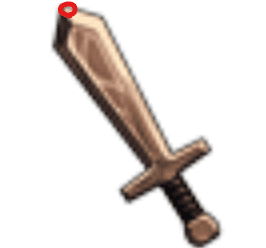

## Unity Skills

### Terrain

- Unity Engine에서 지형을 Brush Tool로 만들 수 있다.
- 자동 `LOD`(`Level Of Detail`) 기능
  > `Level Of Detail`: Object 모습을 카메라와의 거리를 기준으로 교체하면서 시스템 부하를 줄이기 위한 기능
- 

### Light

- Game에서 조명을 담당

  - Directional Light
    > 무한히 멀리 있는 조명  
    > Scene에 모든 것에 영향을 준다.
  - Point Light
    > 하나의 Point 지점에서 일정 범위 부분까지 모든 방향으로 균등하게 비친다.
  - Spot Light
    > 원뿔 형태로 원뿔 안의 Object들만 영향을 미침

- Mode

  - 
  - Realtime
    > 실시간으로 해당 조명으로 감지되는 Object를 계산한다.  
    > ex) 그림자 등
  - Mixed
    > 실시간과 미리 구운 Light map을 적절히 섞어 사용  
    > Light Window에서 여러 Sub Mode 설정
  - Baked
    > Object의 Static 옵션이 체크된 것을 기반으로 Light map을 Generate.

- Auto Generate
  > Unity Editor에서 Light Map을 자동으로 생성할 것인지.  
  > Light와 그 범위에 비춰진 Object가 많을 경우, 시스템 부하가 심히다.
  - |                          Auto Generate                          |                    Static Object                    |
    | :-------------------------------------------------------------: | :-------------------------------------------------: |
    |  |  |

### Navigation

- 길찾기 AI를 만들 수 있는 기능

1. Navigation Path를 Bake
2. 움직일 Object에 Nav Mesh Agent 컴포넌트 연결

   |                1. `Window`-`AI`-`Navigation`                |                    2. Nav Mesh Agent                     |
   | :---------------------------------------------------------: | :------------------------------------------------------: |
   |  |  |

3. Script 작성

   ```cs
   // 컴포넌트 불러오기
   NavMeshAgent nma = gameObject.GetOrAddComponent<NavMeshAgent>();

   // Agent 움직이기
   nma.Move(dir.normalized * moveDist);
   ```

### Stat

- 스탯 정보

```cs
public class Stat : MonoBehaviour
{
    [SerializeField] protected int _level;
    [SerializeField] protected int _hp;
    [SerializeField] protected int _maxHp;
    [SerializeField] protected int _attack;
    [SerializeField] protected int _defence;
    [SerializeField] protected float _moveSpeed;

    public int Level { get { return _level; } set { _level = value; } }
    public int HP { get { return _hp; } set { _hp = value; } }
    public int MaxHp { get { return _maxHp; } set { _maxHp = value; } }
    public int Attack { get { return _attack; } set { _attack = value; } }
    public int Defence { get { return _defence; } set { _defence = value; } }
    public float MoveSpeed { get { return _moveSpeed; } set { _moveSpeed = value; } }

    void Start()
    {
        // 나중에는 Data Sheet(.json)로 초기화
        _level = 1;
        _hp = 100;
        _maxHp = 100;
        _attack = 10;
        _defence = 5;
        _moveSpeed = 5.0f;
    }
}

```

#### PlayerStat

- 상속 매커니즘을 이용.

```cs
public class PlayerStat : Stat
{
    [SerializeField] int _exp;
    [SerializeField] int _gold;

    public int Exp { get { return _exp; } set { _exp = value; } }
    public int Gold { get { return _gold; } set { _gold = value; } }

    void Start()
    {
        // 나중에는 Data Sheet(.json)로 초기화
        _level = 1;
        _hp = 100;
        _maxHp = 100;
        _attack = 10;
        _defence = 5;
        _moveSpeed = 10.0f;
        _exp = 0;
        _gold = 0;
    }
}
```

### Mouse Cursor

- 필요에 따라 마우스 커서 변경

1. Cursor Texture 설정

   - |                        Texture type 설정                        |              Default Cursor Texture 설정              |
     | :-------------------------------------------------------------: | :---------------------------------------------------: |
     |  |  |

2. Script 작성

   - `Ray`, `Texture2D` 이용
   - `SetCursor(Texture2D, Vector3 hotSpot, CursorMode)`
     > `hotSpot`: 마우스 커서 끝이 가리키는 곳
   - |                     `hotSpot` 지점                      |
     | :-----------------------------------------------------: |
     |  |

   ```cs
   // Cursor Texture
   Texture2D _attackIcon;
   Texture2D _handIcon;

   // 매번 Cursor가 바뀌는 것을 방지
   CursorType _cursorType = CursorType.None;

   void Start()
   {
       // Cursor Texture Load
       _attackIcon = GameManager.Resource.Load<Texture2D>("Textures/Cursors/Attack");
       _handIcon = GameManager.Resource.Load<Texture2D>("Textures/Cursors/Hand");
   }

   enum CursorType
   {
       None,
       Hand,
       Attack,
   }

   void UpdateMouseCursor()
   {
       Ray ray = Camera.main.ScreenPointToRay(Input.mousePosition);
       RaycastHit hit;

       if (Physics.Raycast(ray, out hit, 100f, LayerMask.GetMask("Ground") | LayerMask.GetMask("Monster")))
       {
           // Ground, Monster의 Collider와 Ray가 부딪혔을 경우
           if (hit.collider.gameObject.layer == LayerMask.NameToLayer("Monster"))
           {
               // Monster를 가리켰을 경우
               if (_cursorType != CursorType.Attack)
               {
                   // Attack Cursor가 아닐 경우만
                   Cursor.SetCursor(_attackIcon, new Vector2(_attackIcon.width / 5, 0), CursorMode.Auto);
                   _cursorType = CursorType.Attack;
               }
           }
           else
           {
               // 그 외를 가리켰을 경우
               if (_cursorType != CursorType.Hand)
               {
                   // Hand Cursor가 아닐 경우만
                   Cursor.SetCursor(_handIcon, new Vector2(_handIcon.width / 3, 0), CursorMode.Auto);
                   _cursorType = CursorType.Hand;
               }
           }
       }
   }
   ```

### Targeting Lock-on

- Target을 클릭한 상태로 마우스 커서를 움직여도 해당 Target쪽으로 움직이게 하기
  - 
- `InputManager.cs`

  ```cs
  // 시간 측정
  float _pressedTime = 0.0f;

  if (MouseAction != null)    // 이벤트가 등록돼있는지 확인
  {
      if (Input.GetMouseButtonDown(0))
      {
          // 처음 눌렸을 경우
          MouseAction.Invoke(Define.MouseEvent.PointDown);

          // 시간 측정 시작
          _pressedTime = Time.time;
      }
      else if (Input.GetMouseButton(0))
      {
          // 계속 눌릴 경우
          MouseAction.Invoke(Define.MouseEvent.Press);
      }
      else if (Input.GetMouseButtonUp(0))
      {
          // 시간을 분석하여 Click 여부를 알아냄
          if (Time.time - _pressedTime < 1.0f)
              MouseAction.Invoke(Define.MouseEvent.Click);
          else
              MouseAction.Invoke(Define.MouseEvent.PointUp);
      }
  }
  ```

- `PlayerController.cs`

  ```cs
  GameObject _lockTarget;

  void OnMouseEvent(Define.MouseEvent evt)
  {
      if (_state == PlayerState.Die) return;

      // ScreenToWorldPoint() + direction.normalized
      Ray ray = Camera.main.ScreenPointToRay(Input.mousePosition);
      RaycastHit hit;
      bool raycastHit = Physics.Raycast(ray, out hit, 100.0f, LayerMask.GetMask("Ground") | LayerMask.GetMask("Monster"));

      switch (evt)
      {
          case Define.MouseEvent.PointDown:
              if (raycastHit)
              {
                  // Raycast 충돌 발생하면 목적지로 지정
                  _destPos = hit.point;
                  _state = PlayerState.Moving;

                  // "Monster"일 경우, lockTarget 지정
                  if (hit.collider.gameObject.layer == LayerMask.NameToLayer("Monster"))
                      _lockTarget = hit.collider.gameObject;
                  else
                      _lockTarget = null;
              }
              break;
          case Define.MouseEvent.Press:
              // 계속 마우스 버튼을 누르고 있을 경우
              // lockTarget이 있을 경우 target position으로
              if (_lockTarget != null)
                  _destPos = _lockTarget.transform.position;
              else if (raycastHit)
                  _destPos = hit.point;
              break;
          case Define.MouseEvent.PointUp:
              // 버튼을 떼었을 경우
              _lockTarget = null;
              break;
          case Define.MouseEvent.Click:
              // 클릭일 경우
              break;
      }
  }
  ```

### Attack

- Animator State transition -> Code로 Animator Play() 사용
  > Unity Editor의 Animator State 관리 -> Code로 관리
  - 

|                Attack                 |
| :-----------------------------------: |
|  |

#### Attack: State, Update()

- State Property(Set)를 이용하여 Animator의 State와 Code의 State를 묶어서 변경
  > Code State 변경  
  > Animator Get  
  > Animator State 실행

```cs
[SerializeField]
PlayerState _state = PlayerState.Idle;
public enum PlayerState
{
    Idle,
    Moving,
    Die,
    Attack,
}
public PlayerState State
{
    get { return _state; }
    set
    {
        // Set State
        _state = value;

        // Get Animator
        Animator anim = GetComponent<Animator>();

        // State별 Animation 실행
        switch (_state)
        {
            case PlayerState.Die:
                break;
            case PlayerState.Idle:
                anim.CrossFade("WAIT", 0.1f);
                break;
            case PlayerState.Moving:
                anim.CrossFade("RUN", 0.1f);
                break;
            case PlayerState.Attack:
                // (Animation, 다른 Animation으로 Fade out 시간)
                anim.CrossFade("ATTACK", 0.1f);
                break;
        }
    }
}

// State별 Update()
void Update()
{
    switch (_state)
    {
        case PlayerState.Idle:
            UpdateIdle();
            break;
        case PlayerState.Moving:
            UpdateMoving();
            break;
        case PlayerState.Attack:
            UpdateAttack();
            break;
    }
}
```

#### Attack: Idle()

- State -> Idle

```cs
void UpdateIdle()
{

}
```

#### Attack: Moving()

- State -> Idle or Attack

```cs
void UpdateMoving()
{
    // 1. 타겟 오브젝트가 있을 경우
    if (_lockTarget != null)
    {
        _destPos = _lockTarget.transform.position;
        float distance = (_destPos - transform.position).magnitude;

        if (distance < 1.0f)
        {
            State = Define.State.Attack;
            return;
        }
    }

    // 2. 일반적인 이동
    Vector3 dir = _destPos - transform.position;
    if (dir.magnitude < 0.1f)    // float 오차 범위로
    {
        // 도착했을 때
        State = Define.State.Idle;
    }
    else
    {
        if (Physics.Raycast(transform.position + Vector3.up * 0.5f, dir, 1.0f, LayerMask.GetMask("Block")))
        {
            if (Input.GetMouseButton(0) == false)
                State = Define.State.Idle;
            return;
        }

        // 이동
        float moveDist = Mathf.Clamp(_stat.MoveSpeed * Time.deltaTime, 0, dir.magnitude);
        transform.position += dir.normalized * moveDist;
        transform.rotation = Quaternion.Slerp(transform.rotation, Quaternion.LookRotation(dir), 10 * Time.deltaTime);
    }
}
```

#### Attack: Attack(), OnHitEvent()

- OnHitEvent()
  - |         Attack animation에 Call-back Event를 추가         |
    | :-------------------------------------------------------: |
    |  |
- State -> Idle, Attack

```cs
void OnHitEvent()
{
    if (_lockTarget == null)
    {
        State = Define.State.Idle;
    }
    else
    {
        State = Define.State.Attack;
    }
}

void UpdateAttack()
{
    if(_lockTarget != null)
    {
        // Target Object를 바라보도록
        Vector3 dir = _lockTarget.transform.position - transform.position;
        transform.rotation = Quaternion.Slerp(transform.rotation, Quaternion.LookRotation(dir), 20 * Time.deltaTime);
    }
}
```

### HP Gauge

1. World Space Canvas 생성
   > 카메라와의 원근법을 적용시키기 위해서
2. Slider 생성
   > Fill Area, Fill 영역 설정
3. UI_HPBar.cs 작성
   > Position, Rotation 설정

#### World Space Canvas

|                     Slider 생성                     |                   Render Mode: World Space                    |                      Fill Area 영역 설정                      |                   Fill 영역 설정                    |
| :-------------------------------------------------: | :-----------------------------------------------------------: | :-----------------------------------------------------------: | :-------------------------------------------------: |
|  |  |  |  |

#### UI_HPBar.cs 작성

- HPBar(= Slider)의 Position
  > Collider의 꼭대기 지점
- Slider의 Value를 조절하여 Fill 영역 변경
- HP_Bar의 방향은 항상 메인 카메라와의 바라보는 방향이 동일하도록 설정
  > 항상 카메라 앞쪽으로 똑바로 보이도록

```cs
public class UI_HPBar : UI_Base
{
    void Update()
    {
        // Get 부모 GameObject
        Transform parent = transform.parent;
        // GameObject의 Collider 꼭대기 지점으로
        transform.position = parent.position + Vector3.up * parent.GetComponent<Collider>().bounds.size.y;
        // 메인 카메라의 Rotation과 HP Bar의 Rotation이 같다.
        // 같은 방향 바라보도록
        transform.rotation = Camera.main.transform.rotation;

        // HP 갱신
        float ratio = (float)_stat.HP / _stat.MaxHp;
        SetRatio(ratio);
    }

    Stat _stat;

    enum GameObjects
    {
        HPBar
    }

    public override void init()
    {
        // Binding
        Bind<GameObject>(typeof(GameObjects));
        // Get Stat 정보
        _stat = transform.parent.GetComponent<Stat>();
    }

    public void SetRatio(float ratio)
    {
        // HPBar의 Slider의 value 조절
        GetObject((int)GameObjects.HPBar).GetComponent<Slider>().value = ratio;
    }
}
```

#### Monster HP 감소

- Monster에 HP_Bar를 연결 후, HP 감소시키기
  - 

```cs
void OnHitEvent()
{
    if (_lockTarget == null)
    {
        State = PlayerState.Idle;
        return;
    }

    // Target Object의 Stat의 HP 감소
    Stat targetStat = _lockTarget.GetComponent<Stat>();
    int damage = Mathf.Max(0, _stat.Attack - targetStat.Defence);
    targetStat.HP -= damage;

    // Target Object로 방향 전환
    Vector3 dir = _lockTarget.transform.position - transform.position;
    transform.rotation = Quaternion.Slerp(transform.rotation, Quaternion.LookRotation(dir), 20 * Time.deltaTime);
}
```

### Monster AI

- | Monster는 Player tag가 붙어있는 GameObject가 특정 거리 범위 안으로 들어온다면 공격 상태로 전환 |
  | :--------------------------------------------------------------------------------------------: |
  |                                                   |

```cs
// 최소 Scan 범위: Vector3의 magnitude를 이용
[SerializeField] float _scanRange = 10.0f;
// 최소 Attack 범위: Vector3의 magnitude를 이용
[SerializeField] float _attackRange = 2.0f;
```

#### Monster: OnHitEvent()

```cs
// Animation Call-back func
void OnHitEvent()
{
    if (_lockTarget == null)
    {
        // 해당 몬스터가 때리는 순간에 플레이어는 죽을 수 있다.(= Destroy)
        State = Define.State.Idle;
    }
    else
    {
        // 상대 체력 감소
        Stat targetStat = _lockTarget.GetComponent<Stat>();
        int damage = Mathf.Max(0, _stat.Attack - targetStat.Defence);
        targetStat.Hp -= damage;

        if (targetStat.Hp > 0)
        {
            // 체력이 있을 때
            // distance: magnitude로 구함
            float distance = (_lockTarget.transform.position - transform.position).magnitude;

            // Attack 범위 비교
            if (distance <= _attackRange)
                State = Define.State.Attack;
            else
                State = Define.State.Moving;
        }
        else
        {
            // 체력이 0이하 일때 Idle 상태 변경
            State = Define.State.Idle;
        }
    }
}
```

#### Monster: UpdateIdle()

```cs
void UpdateIdle()
{
    // Player tag로 GameObject 찾음
    GameObject player = GameObject.FindGameObjectWithTag("Player");
    if (player == null)
        return;

    float distance = (player.transform.position - transform.position).magnitude;
    if (distance <= _scanRange)
    {
        // 최소 Scan 범위보다 가까우면 달려감
        _lockTarget = player;
        State = Define.State.Moving;
        return;
    }
}
```

#### Monster: UpdateMoving()

```cs
void UpdateMoving()
{
    NavMeshAgent nma = gameObject.GetOrAddComponent<NavMeshAgent>();

    // 1. 타겟 오브젝트가 있을 경우
    if (_lockTarget != null)
    {
        _destPos = _lockTarget.transform.position;

        float distance = (_destPos - transform.position).magnitude;
        if (distance <= _attackRange)
        {
            // Attack 범위에 왔으면 멈추도록
            nma.SetDestination(transform.position);

            State = Define.State.Attack;
            return;
        }
        else if (distance > _scanRange)
        {
            // 스캔 범위 초과
            _destPos = transform.position;
            _lockTarget = null;
        }
    }

    // 2. 일반 이동
    Vector3 dir = _destPos - transform.position;
    if (dir.magnitude < 0.1f)    // float 오차 범위로
    {
        // 도착했을 때
        nma.SetDestination(transform.position);
        State = Define.State.Idle;
    }
    else
    {
        // 목표 지점으로 이동
        nma.SetDestination(_destPos);
        // 움직이는 속도 설정
        nma.speed = _stat.MoveSpeed;

        transform.rotation = Quaternion.Slerp(transform.rotation, Quaternion.LookRotation(dir), 10 * Time.deltaTime);
    }
}
```

#### Monster: UpdateAttack()

```cs
void UpdateAttack()
{
    if (_lockTarget != null)
    {
        // 공격할 때 바라보도록
        Vector3 dir = _lockTarget.transform.position - transform.position;
        transform.rotation = Quaternion.Slerp(transform.rotation, Quaternion.LookRotation(dir), 20 * Time.deltaTime);
    }
}
```

---
