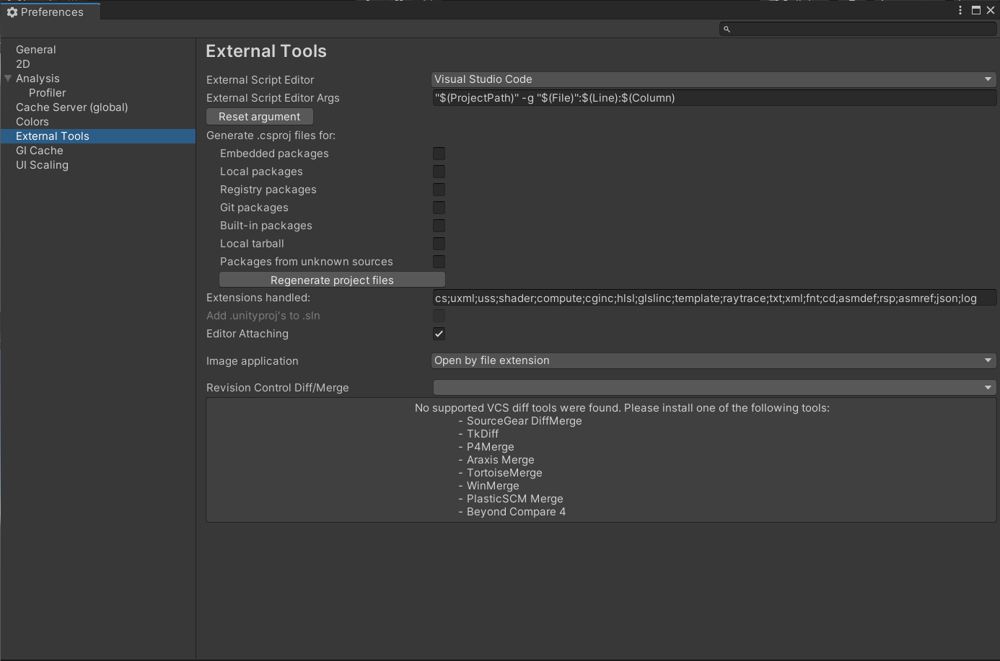

## Unity 기초

### 환경 설정(`Unity`+`VSCode`)

- 그래픽 환경

1. Unity Hub 다운로드 & 설치
2. Unity 설치: `LTS`(Long Term Support) 버전(현재는 `2019.4.20f1`)
3. Unity Project 생성: Template-`3D`

- 스크립트 환경

1. Visual Studio Code 설치
2. VSCode Extension 설치
   - |                     C#                      |                           Debugger for Unity                            |                        Unity Tools                        |                            Unity Code Snippets                            |
     | :-----------------------------------------: | :---------------------------------------------------------------------: | :-------------------------------------------------------: | :-----------------------------------------------------------------------: |
     |  |  |  |  |
3. Unity Code Editor 설정
   - | `Preferences`-`External Tools`-`External Script Editor`-`Visual Studio Code` |
     | :--------------------------------------------------------------------------: |
     |  |

### 화면 창(Window)

|   view    |               description                |
| :-------: | :--------------------------------------: |
|   Scene   | (=영화 세트장), GameObject가 배치된 View |
| Hierarchy |       GameObject의 List(Tree 형태)       |
|  Project  |     Project와 관련된 모든 파일 표시      |
|   Game    |   Main Camera에 의해 렌더링 되는 View    |
| Inspector |  선택한 GameObject에 대한 컴포넌트 정보  |
|    ...    |                   ...                    |

### 유용한 단축키

|                       단축키                       |                 description                 |
| :------------------------------------------------: | :-----------------------------------------: |
|                     `Ctrl`+`P`                     |                 Play / Stop                 |
|                 `Ctrl`+`Shift`+`N`                 |               New GameObject                |
|           `RMB Click`+`W`, `A`, `S`, `D`           |              Scene View 움직임              |
|             `RMB Click`+`Mouse Wheel`              |         Scene View 움직임 속도 조절         |
|                     `Ctrl`+`Z`                     |                  되돌리기                   |
|                    `W` in Scene                    |          Move tool(Object Control)          |
|                    `E` in Scene                    |                 Rotate tool                 |
|                    `R` in Scene                    |                 Scale tool                  |
| `Camera GameObject Click` + `Ctrl` + `Shift` + `F` | Scene View와 Camera View의 Transfrom 동기화 |
|               `Ctrl` + `Shift` + `C`               |            Console 창 뜨게 하기             |
|                        ...                         |                     ...                     |

### Component Pattern

- Code를 부품화해서 관리한다.
- Unity에서 모든 GameObject는 컴포넌트 정보에 따라 달라진다.
- C# Script를 작성하여 컴포넌트로 사용한다.

- Unity 에서는 MonoBehaviour를 상속을 해야 컴포넌트로써 실행이 가능

  - 따라서, MonoBehaviour를 상속받는 Class는 `new 클래스명();` 불가능
  - Create C# Script--상속--`MonoBehaviour Class`----`Behaviour`----`Component`----`Object`

- ex) 오브젝트 회전 컴포넌트

  ```cs
  using System.Collections;
  using System.Collections.Generic;
  using UnityEngine;

  public class Test : MonoBehaviour
  {
      void Update()
      {
          transform.Rotate(new Vector3(1.0f, 1.0f, 1.0f));
      }
  }
  ```

  |                              결과                              |
  | :------------------------------------------------------------: |
  |  |

### Singleton Pattern

- 대부분 관리(`Managing`)하는 객체(`Instance`)는 오직 1개만 존재해야 함.
  - 최초의 생성자로 1번만 객체를 생성.
  - 여러 차례 생성자를 호출하면 최초로 생성된 객체를 `return` 해준다.

#### Manager 예제

- `Manager`는 어디서든 접근할 수 있고 객체는 오직 1개만 존재.

  1. `MonoBehaviour` Class를 상속 O

     - `GameObject`로 관리
       > `GameObject.Find("@Manager");` 이용

     ```cs
     using System.Collections;
     using System.Collections.Generic;
     using UnityEngine;

     public class Manager : MonoBehaviour // MonoBehaviour를 상속
     {
         private static Manager instance;    // 유일성 보장
         public static Manager Instance
         {
             get
             {
                 if (instance == null) init();
                 return instance;
             }
         }    // get, Property 이용

         static void init()
         {
             // 이름으로 Manager를 찾음.
             GameObject go = GameObject.Find("@Manager");
             if (go == null)
             {
                 // "@Manager"의 GameObject가 없다면 Object 생성
                 go = new GameObject { name = "@Manager" };
                 go.AddComponent<Manager>();   // Script 컴포넌트 추가
             }
             // 삭제하지 못하게 함, Scene이 이동해도 제거되지 않음.
             DontDestroyOnLoad(go);
             instance = go.GetComponent<Manager>();
         }
     }
     ```

  2. `MonoBehaviour` Class를 상속 X

     - `Scene` 이동에 신경쓸 필요 없는 장점이 있다.
     - 눈에 보이지 않는 단점으로 보통은 1번 방법 사용

     ```cs
     public class Manager    // MonoBehaviour를 상속받지 않음.
     {
         private static Manager instance;    // 유일성 보장
         public static Manager Instance
         {
             // get, property 이용
             get
             {
                 if (instance == null) instance = new Manager();
                 return instance;
             }
         }
         public Manager()
         {
             // 초기화 코드
         }
     }
     ```

## Transform

### Player

- 모든 Player, 게임 물체는 `GameObject`고 이를 제어해 사용한다.
- `Transform` 컴포넌트로 `GameObject`의 `Position`(위치), `Rotation`(회전), `Scale`(크기)를 제어한다.

- In code
  - |         `GameObject`          |            `Transform`             |
    | :---------------------------: | :--------------------------------: |
    | `transform.gameObject`로 접근 |  `transform.position`로 위치 조절  |
    |                               |  `transform.rotation`로 회전 조절  |
    |                               | `transform.localScale`로 크기 조절 |

### Position

- `transform.position`으로 Object를 움직인다.
- 3차원 좌표 `Vector3`를 사용한다.
- `position` vs `localPosition`

  - | transform.postion | transform.localPosition |
    | :---------------: | :---------------------: |
    |   World 좌표계    |      Local 좌표계       |
    |    World 기준     |    해당 Object 기준     |

- World 좌표계 기준으로 움직이기

  - 

  ```cs
  using System.Collections;
  using System.Collections.Generic;
  using UnityEngine;

  public class PlayerController : MonoBehaviour
  {
      // [SerializeField] 를 이용하면 Editor에서 Value 조절 가능
      [SerializeField] float _speed = 10.0f;

      // 1 frame마다 호출된다, 보통 60 Frame = 1 sec
      void Update()
      {
          if (Input.GetKey(KeyCode.W)) // Input: Key 입력과 연관된 Class
              transform.position += Vector3.forward * Time.deltaTime * _speed;
              // Vector3.forword=(0.0f, 0.0f, 1.0f): World 좌표계 기준
          if (Input.GetKey(KeyCode.S))
              transform.position += Vector3.back * Time.deltaTime * _speed;
              // Vector3.back=(0.0f, 0.0f, -1.0f)
          if (Input.GetKey(KeyCode.A))
              transform.position += Vector3.left * Time.deltaTime * _speed;
              // Vector3.left=(-1.0f, 0.0f, 0.0f)
          if (Input.GetKey(KeyCode.D))
              transform.position += Vector3.right * Time.deltaTime * _speed;
              // Vector3.right=(1.0f, 0.0f, 0.0f)
      }
  }
  ```

#### Input Class

- Key 입력에 대한 Class.
- |    `GetKey(KeyCode k)`    |    `GetKeyDown(KeyCode k)`    |  `GetKeyUp(KeyCode k)`   |
  | :-----------------------: | :---------------------------: | :----------------------: |
  | 입력되는 중="ing"(`N 번`) | 입력이 최초로 눌릴 때(`1 번`) | 입력이 끝났을 때(`1 번`) |

#### Time.deltaTime

- 1 Frame당 실행하는 시간.
- (현재 프레임 시간 - 지난 프레임 시간)
- 곱하는 이유

  > 시간과 비례해서 증가  
  > 만약, 100 FPS 컴퓨터와 10 FPS 컴퓨터는 1초당 이동 거리가 다를 것이다.  
  > 따라서 걸린 시간(Time.deltaTime)을 곱해주면 동일한 이동거리의 결과를 보여준다.

#### TransformDirection()

- 오브젝트 기준 좌표계 -> 월드 기준 좌표계
- Local 좌표계-> World 좌표계

  > `InverseTransformDirection()`: World -> Local 좌표

- `TransformDirection()`을 이용한 오브젝트 기준 움직이기

  - 

  ```cs
  void Update()
  {
      if (Input.GetKey(KeyCode.W))
          transform.position += transform.TransformDirection(Vector3.forward * Time.deltaTime * _speed);
          // 오브젝트 기준 좌표계 -> 월드 기준 좌표계
      if (Input.GetKey(KeyCode.S))
          transform.position += transform.TransformDirection(Vector3.back * Time.deltaTime * _speed);
      if (Input.GetKey(KeyCode.A))
          transform.position += transform.TransformDirection(Vector3.left * Time.deltaTime * _speed);
      if (Input.GetKey(KeyCode.D))
          transform.position += transform.TransformDirection(Vector3.right * Time.deltaTime * _speed);
  }
  ```

#### tramsform.Translate()

- Local 좌표계로 이동해줌.

- 오브젝트 기준으로 움직이기

  - 

  ```cs
  using System.Collections;
  using System.Collections.Generic;
  using UnityEngine;

  public class PlayerController : MonoBehaviour
  {
      [SerializeField] float _speed = 10.0f;

      void Update()
      {
          if (Input.GetKey(KeyCode.W))
              transform.Translate(Vector3.forward * Time.deltaTime * _speed);
              // 오브젝트 기준으로 Position을 변경한다.
          if (Input.GetKey(KeyCode.S))
              transform.Translate(Vector3.back * Time.deltaTime * _speed);
          if (Input.GetKey(KeyCode.A))
              transform.Translate(Vector3.left * Time.deltaTime * _speed);
          if (Input.GetKey(KeyCode.D))
              transform.Translate(Vector3.right * Time.deltaTime * _speed);
      }
  }

  ```

### Vector3

- `Transform`은 `Vector3`를 사용한다.
- 멤버변수는 `float x`, `float y`, `float z` 로 구성됨.
- `Vector3` 용도

  1. 위치 벡터
     > 좌표로 위치 정의
  2. 방향 벡터

     > (다음 위치 - 현재 위치)  
     > "거리(크기)", "방향"을 알아냄

     - transform.position.magnitude
       > Vector의 크기 반환  
       > 피타고라스 정리 이용(`x*x + y*y + z*z`)
     - transform.position.normalized
       > Vector의 방향 단위 벡터: 크기(`Magnitude`)가 1  
       > 각 `x`, `y`, `z`를 `magnitude`로 나눠준 값

### Rotation

- `transform.rotation(Quaternion)`
  > `eulerAngle`보다 사용 권장
- `transform.eulerAngles(Vector3)`

  > 절댓값으로 넣어줘야 함  
  > **`+=(Increment)` 사용 X**  
  > **공식 문서**: `Increment`를 사용할 경우 360도가 넘어가 오작동 발생

- |           `EulerAngles`           |           `Quaternion`            |
  | :-------------------------------: | :-------------------------------: |
  |              x, y, z              |        x, y, z, w: 사원수         |
  |           Vector3 사용            |      Vector3를 변환해서 사용      |
  |    `Gimbal Lock` 문제 **발생**    |    `Gimbal Lock` 문제 **해결**    |
  | `transform.eulerAngles = Vector3` | `transform.rotation = Quaternion` |

- `Gimbal Lock` 문제
  > 각 축의 연관성으로 회전을 계속하면 축들이 겹쳐 회전이 먹통이 되는 문제  
  > `Quaternion` 으로 해결

#### Y축을 기준으로 회전 예제

- 

1. `transform.eulerAngles`

   > 절대적으로 `Vector3`를 대입한다.  
   > 상태 회전 변수 필요

   ```cs
   float yAngle = 0.0f;
   void Update()
   {
     yAngle += Time.deltaTime * 100.0f;   // 상태 회전 변수 갱신
     transform.eulerAngles = new Vector3(0.0f, yAngle, 0.0f);  // 절대적으로 대입
     // transform.eulerAngles += yAngle;    // 사용 X
   }
   ```

2. `transform.Rotate(Vector3)`

   > `Vector3` 대입  
   > 상대적으로 회전: 현재 회전값 기준

   ```cs
   void Update()
   {
     // 현재 회전 상태 기준으로 회전(상대적)
     transform.Rotate(new Vector3(0.0f, Time.deltaTime * 100.0f, 0.0f));
   }

   ```

3. `Quaternion.Euler(Vector3)`

   ```cs
   float yAngle = 0.0f;
   void Update()
   {
     yAngle += Time.deltaTime * 100.0f;   // 상태 회전 변수 갱신

     // Euler -> Quaternion 변환
     transform.rotation = Quaternion.Euler(new Vector3(0.0f, _yAngle, 0.0f));
   }
   ```

#### 특정 방향 바라보기 예제

- `Quaternion.LookRotation(Vector3)`

  > 원하는 방향을 바라보게 함

  - 

  ```cs
  void Update()
  {
      // 월드좌표 기준 바라보게 함
      transform.rotation = Quaternion.LookRotation(Vector3.forward);
  }
  ```

- `Quaternion.Slerp(Vector3, Vector3, float)`

  > 부드럽게 바라보게 함.  
  > Slerp(현재 방향, 목표 방향, 비율)

  - 

  ```cs
  void Update()
  {
      // 현재 방향에서 월드 기준 forward(앞)으로 부드럽게 바라보게 함.
      transform.rotation = Quaternion.Slerp(transform.rotation, Quaternion.LookRotation(Vector3.forward), 0.3f);
  }
  ```

### Input-Manager

- `Listener` 역할
- 사용자 입력을 체크하고 이벤트로 실행한다.

1. `InputManager` Class 작성

   ```cs
   public class InputManager   // MonoBehaviour를 상속 X
   {
       public Action KeyAction = null;

       public void OnUpdate()  // Listener
       {
           if (!Input.anyKey) return;  // 아무 키가 입력되지 않으면

           if (KeyAction != null)  // 이벤트가 등록돼있는지 확인
               KeyAction.Invoke(); // 모두 알려주고 실행하도록 함.
       }
   }
   ```

2. `Manager`에서 관리

   ```cs
   public class Manager : MonoBehaviour
   {
       static Manager instance;    // 유일성 보장
       static Manager Instance { get { if (instance == null) init(); return instance; } }    // get, Property 이용

       InputManager input = new InputManager();
       public static InputManager Input { get { return Instance.input; } }

       void Update()
       {
           input.OnUpdate();   // 이벤트를 체크
       }
   }
   ```

3. `PlayerController`에서 등록

   ```cs
   public class PlayerController : MonoBehaviour
   {
       [SerializeField] float _speed = 10.0f;

       void Start()
       {
           // 리스너 등록
           Manager.Input.KeyAction -= OnKeyboard;  // 두 번 등록 방지
           Manager.Input.KeyAction += OnKeyboard;
       }

       void OnKeyboard()
       {
           if (Input.GetKey(KeyCode.W))
           {
               transform.rotation = Quaternion.Slerp(transform.rotation, Quaternion.LookRotation(Vector3.forward), 0.3f);
               transform.position += Vector3.forward * Time.deltaTime * _speed;
           }
           if (Input.GetKey(KeyCode.S))
           {
               transform.rotation = Quaternion.Slerp(transform.rotation, Quaternion.LookRotation(Vector3.back), 0.3f);
               transform.position += Vector3.back * Time.deltaTime * _speed;
           }
           if (Input.GetKey(KeyCode.A))
           {
               transform.rotation = Quaternion.Slerp(transform.rotation, Quaternion.LookRotation(Vector3.left), 0.3f);
               transform.position += Vector3.left * Time.deltaTime * _speed;
           }
           if (Input.GetKey(KeyCode.D))
           {
               transform.rotation = Quaternion.Slerp(transform.rotation, Quaternion.LookRotation(Vector3.right), 0.3f);
               transform.position += Vector3.right * Time.deltaTime * _speed;
           }
       }
   }
   ```

---

## Resource Managing

### Prefab

- `Pre-Fabrication`: 조립식, 미리 만든 물건
- 재사용 `GameObject`
- `Class`-`Instance` 구조에서의 `Class`와 동일

  > 일종의 붕어빵 틀(= `Class`)  
  > 붕어빵: `Instance`(객체)

- Code(C#)

  ```cs
  class Prefab { } // 붕어빵 틀

  class test
  {
      static void Main(string[] args)
      {
          Prefab prefab1 = new Prefab();  // 붕어빵 1
          Prefab prefab2 = new Prefab();  // 붕어빵 2
          Prefab prefab3 = new Prefab();  // 붕어빵 3
      }
  }
  ```

#### Prefab Override

> `Prefab` 속성을 변경

1. `Project`-해당 `Prefab` 클릭 or 더블클릭(상세 설정)
2. `Prefab` 속성 변경

#### Prefab Variants

- `Prefab`을 `Override`한 `Prefab` 생성
  > vs `Original Prefab`은 독립적인 `Prefab` 생성
- Code(C#)

  ```cs
  class Prefab
  {
      float name="original";
  }

  class PrefabVariant: Prefab
  {
      float name="varient";
  }
  ```

#### Nested Prefabs

- `Prefab`을 포함한 `GameObject`를 `Prefab`으로 생성

- Code(C#)

  ```cs
  class NestedPrefab
  {
      Prefab prefab;    // Prefab을 감싸고 있는 Nested Prefab
  }
  class Prefab { }
  ```

### Resource Manager

#### Prefab -> GameObject 예제

- `Project`에 있는 Prefab을 PrefabTest Script의 `Inspector` 이용

  - 

  ```cs
  public class PrefabTest : MonoBehaviour
  {
      [SerializeField] GameObject prefab; // prefab을 담음
      GameObject tank;

      void Start()
      {
          tank = Instantiate(prefab);   // Prefab -> GameObject

          Destroy(tank, 3.0f);  // 3초 후에 삭제
      }
  }
  ```

#### Resource Manger [X]

- Test

  - 

  ```cs
  public class PrefabTest : MonoBehaviour
  {
      GameObject prefab;  // Prefab을 담을 GameObject
      GameObject tank;

      void Start()
      {
          // "Asset/Resource"가 "/"(root) 에서 불러오기
          prefab = Resources.Load<GameObject>("Prefabs/Tank");
          tank = Instantiate(prefab);

          Destroy(tank, 3.0f);  // 3초 후에 제거
      }
  }
  ```

#### Resource Manger [O]

1. Resource Manager 추가

   ```cs
   public class ResourceManager    // MonoBehaviour 상속 X
   {
       public T Load<T>(string path) where T : Object
       {
           return Resources.Load<T>(path);
       }

       public GameObject Instantiate(string path, Transform parent = null)
       {
           GameObject prefab = Load<GameObject>($"Prefabs/{path}");
           if (prefab == null)
           {
               Debug.Log($"Failed to load prefab: {prefab}");
               return null;
           }
           return Object.Instantiate(prefab, parent);  // Object의 Instantiate
       }

       public void Destroy(GameObject gameObject)
       {
           if (gameObject == null) return;

           Object.Destroy(gameObject);
       }
   }
   ```

2. Manager에 ResourceManager 추가

   ```cs
   ResourceManager _resorce = new ResourceManager();

   public static ResourceManager Resource { get { return Instance._resorce; } }
   ```

3. Test

   - 

   ```cs
   public class PrefabTest : MonoBehaviour
   {
       GameObject tank;

       void Start()
       {
           tank = Manager.Resource.Instantiate("Tank");

           Destroy(tank, 3.0f);
       }
   }
   ```

### 폴더 정리

- `Resources`
  > Scene에서 사용하는 리소스 모음
  - `Prefabs`
    > Game에서 사용할 조립형 GameObject 모음
  - `Arts`
    > 디자이너 분이 주시는 Art 모음(ex. Charater)
    - `Models`
      > 해당 Art에서의 Model 모음  
      > Prefab을 만들기 위한 Asset
    - `Sounds`
      > 해당 Art에서의 Sound 모음
    - `Textures`
      > 해당 Art에서의 Model들의 Texture 모음
    - `Materials`
      > 해당 Art에서의 Model들의 Material 모음  
      > Texture들을 모아 붙인 재질
    - `Animations`
      > 해당 Art에서의 Model들의 Animation 모음
- `Scenes`
  > Unity 에서 사용하는 Scene 모음
- `Scripts`
  > `C#` Scripts

---

## Collision: 충돌

### Collider: 충돌체

- Rigidbody: 강체

  > 공식 API 문서: Object를 물리적인 시뮬레이션으로 위치를 조절한다.

  - Mass: 질량(kg)
  - Use Gravity: 중력
  - Is Kinematic
    > `Physics`가 `Rigidbody`에 영향 여부 결정  
    > 해당 속성을 설정하고 충돌 판정을 하는데 주로 사용한다.
  - Constraint
    - Position: 특정 축(`x`, `y`, `z`)에 대한 위치 고정
    - Rotation: 특정 축(`x`, `y`, `z`)에 대한 회전 고정

- Collider: 충돌체

  > 공식 API 문서: `Rigidbody`와 함께 사용하여 물리적 상호작용을 적용한다.  
  > `Is Kinematic`으로 물리적 상호작용을 안할 수 있다.

### Collision vs Trigger

|        Collision        |         Trigger         |
| :---------------------: | :---------------------: |
|       Collider[O]       |       Collider[O]       |
| 나 or 상대 Rigidbody[O] | 나 or 상대 Rigidbody[O] |
|      Is Trigger[X]      |      Is Trigger[O]      |
|  Is Kinematic[O or X]   |  Is Kinematic[O or X]   |

- 요약

  - `Collision`과 `Trigger`의 차이는 `Is Trigger` 차이!
  - `Collision`과 `Trigger`는 둘 중 하나는 `Rigidbody`를 가지고 있어야 한다.
  - `Trigger`의 비용이 더 적다.

- `Enter` vs `Stay` vs `Exit`

  |             Enter             |            Stay             |             Exit              |
  | :---------------------------: | :-------------------------: | :---------------------------: |
  | 충돌, 트리거가 발생 시작(1번) | 충돌, 트리거가 발생 중(N번) | 충돌, 트리거가 발생 종료(1번) |

- Code

  ```cs
  // Trigger: Is Trigger[O]
  void OnTriggerEnter(Collider other) { } // 발생 시작(1번)
  void OnTriggerStay(Collider other) { }  // 발생 중(N번)
  void OnTriggerExit(Collider other) { }  // 발생 끝(1번)

  // Collision: Is Trigger[X]
  void OnCollisionEnter(Collision other) { }  // 발생 시작(1번)
  void OnCollisionStay(Collision other) { }   // 발생 중(N번)
  void OnCollisionExit(Collision other) { }   // 발생 끝(1번)
  ```

### Raycast

- 광선을 쏴서 충돌 정보를 추출

#### Physics.Raycast(), Physics.RaycastAll(), Debug.DrawRay()

|                               `Physics.Raycast()`                                |                   `Physics.RaycastAll()`                   |                           `Debug.DrawRay()`                            |
| :------------------------------------------------------------------------------: | :--------------------------------------------------------: | :--------------------------------------------------------------------: |
|                                    개발 용도                                     |                         개발 용도                          |                              디버깅 용도                               |
|                           충돌 발생 여부(`bool`) 반환                            |    충돌 발생 정보를 담은 객체 배열(`RaycastHit[]`) 반환    |                                 `void`                                 |
|                       처음 충돌한 객체 정보만 알 수 있다.                        |             충돌한 객체 정보 모두 알 수 있다.              |                        충돌 객체 정보 확인 불가                        |
|                                     가시성 X                                     |                          가시성 X                          |              `Scene`에서 확인 가능, 광선 Color 설정 가능               |
| (`Vector3 start`, `Vector3 dir`, `RaycastHit hitInfo`, `float maxDistance`), ... | (`Vector3 start`, `Vector3 dir`, `float maxDistance`), ... | (`Vector3 start`, `Vector3 dir`, `Color color`, `float duration`), ... |
|                  `maxDistance`를 설정 안하면 충돌할 때까지 발사                  |          `maxDistance`를 설정 안하면 끝까지 발사           |                        방향 벡터 크기만큼 발사                         |

#### Debug.DrawRay 예제

- 

```cs
// 현재 position에서 World 기준 (0, 0, 1) 방향으로 Red 색깔로 광선 발사
Debug.DrawRay(transform.position, Vector3.forward, Color.red);
```

#### Physics.Racast()

- `Raycast()` 처음 충돌체 정보만 추출 가능
- 

```cs
// 플레이어 기준 forward로 변환
Vector3 look = transform.TransformDirection(Vector3.forward);

// hit된 정보를 담고 있는 객체
RaycastHit hit;

// 현재 position+(0, 1, 0)에서 look 방향으로 최대 10의 길이로 광선 발사한 정보를 hit에 저장
if (Physics.Raycast(transform.position + Vector3.up, look, out hit, 10))
{
    // Raycast로 충돌이 발생하면 이름 출력
    Debug.Log($"RayCast: {hit.collider.gameObject.name}");
}

// 현재 position+(0, 1, 0)에서 look 방향으로 10의 길이로 Red 색깔로 광선 발사
Debug.DrawRay(transform.position + Vector3.up, look * 10, Color.red);
```

#### Physics.RaycastAll()

- `RaycastAll()` 충돌체 정보 모두 추출 가능
- 

```cs
// 플레이어 기준 forward로 변환
Vector3 look = transform.TransformDirection(Vector3.forward);

// 충돌 발생한 정보를 담는 객체 배열
RaycastHit[] hits;

// 현재 position+(0, 1, 0)에서 look 방향으로 최대 10의 길이로 광선 발사한 정보 객체 배열을 반환
hits = Physics.RaycastAll(transform.position + Vector3.up, look, 10);

foreach (RaycastHit hit in hits)
{
    // 정보를 담고있는 객체 배열 모두 출력
    Debug.Log($"RayCast: {hit.collider.gameObject.name}");
}

// 현재 position+(0, 1, 0)에서 look 방향으로 10의 길이로 Red 색깔로 광선 발사
Debug.DrawRay(transform.position + Vector3.up, look * 10, Color.red);
```

### 투영: Projection

- 3D ---> 2D
- `World 좌표계(x, y, z)`에서 `Screen 좌표계(x, y)`로 투영(`Prejection`)
- `Local 좌표계` --`Convert`--> `World 좌표계` --`Projection`--> `Screen 좌표계`

|                            투영 과정                             |
| :--------------------------------------------------------------: |
|  |

- 

```cs
// Screen 좌표 픽셀 반환
Vector3 pixel = Input.mousePosition;
Debug.Log($"Screen 좌표의 픽셀: {pixel}");

// Scrrent 비율 좌표(0 ~ 1)
Vector3 ratio = Camera.main.ScreenToViewportPoint(Input.mousePosition);
Debug.Log($"Screen 좌표의 비율: {ratio}");
```

### Screen(Mouse-Position) to World

- 

1. Version 1

   1. 화면 마우스 위치 --> 월드 좌표계
   2. 방향 추출(현재 좌표 - 이전 좌표)
   3. 방향 단위벡터 변환
   4. Raycasting

   ```cs
   // LMB 클릭 시(1번)
   if (Input.GetMouseButtonDown(0))
   {
       // 실제 Screen에 Pointing한 마우스 위치(픽셀 좌표)
       Vector3 inputMouse = Input.mousePosition;

       // World에 Pointing한 마우스 위치
       Vector3 mousePos = Camera.main.ScreenToWorldPoint(new Vector3(inputMouse.x, inputMouse.y, Camera.main.nearClipPlane));

       // (World에 Pointing된 마우스 위치 - Camera 현재 좌표) = 카메라 방향
       Vector3 dir = mousePos - Camera.main.transform.position;

       // 단위벡터로 변환(크기가 1)
       dir = dir.normalized;

       RaycastHit hit;
       if (Physics.Raycast(Camera.main.transform.position, dir, out hit, 100f))
       {
           // Raycast 충돌 발생하면 충돌체 이름 출력
           Debug.Log($"Racast Camera: @{hit.collider.gameObject.name}");
       }

       // 메인 카메라 위치에서 dir 방향으로 100의 길이만큼 1초 동안 빨간색 광선 발사
       Debug.DrawRay(Camera.main.transform.position, dir * 100f, Color.red, 1f);
   }
   ```

2. Version 2

   1. `ScreenPointToRay()` 이용하여 화면에 입력된 마우스 위치 광선 추출
   2. Raycasting

   ```cs
   if (Input.GetMouseButtonDown(0))
   {
       // ScreenToWorldPoint() + direction.normalized
       Ray ray = Camera.main.ScreenPointToRay(Input.mousePosition);

       RaycastHit hit;

       // Raycast overload func
       // ray를 최대 100f 거리만큼 발사하여 충돌체 정보를 hit에 저장
       if (Physics.Raycast(ray, out hit, 100f))
       {
           // Raycast 충돌 발생하면 충돌체 이름 출력
           Debug.Log($"Racast Camera: @{hit.collider.gameObject.name}");
       }

       // 메인 카메라 위치에서 dir 방향으로 100의 길이만큼 1초 동안 빨간색 광선 발사
       Debug.DrawRay(Camera.main.transform.position, ray.direction * 100f, Color.red, 1f);
   }
   ```

### 충돌 판정 최적화

- `Raycasting` 연산은 부하가 많기 때문에 최적화가 필요하다.
- `LayerMask`와 `Tag`(?)를 이용하여 충돌 판정을 조절한다.

|                 Layer                  |                Tag                 |
| :------------------------------------: | :--------------------------------: |
|  |  |

#### LayerMask

- `Layer`(묶음)별로 충돌 판정을 조절할 수 있다.
- `Layer` 갯수는 `32`개, Why. `Int(32 bits)`를 이용한 `bit-masking`

  ```cs
  // 0x00000010, Layer 8, 9만 masking
  int mask = (1 << 8) | (1 << 9); // OR 연산

  // 위 구문과 동일, string으로 접근
  LayerMask mask = LayerMask.GetMask("Layer8") | LayerMask.GetMask("Layer9");
  ```

- Test

  ```cs
  if (Input.GetMouseButtonDown(0))
  {
      // direction을 포함하는 광선
      Ray ray = Camera.main.ScreenPointToRay(Input.mousePosition);

      // 0x00000010, Layer 8, 9만 masking
      int mask = (1 << 8) | (1 << 9);

      RaycastHit hit;
      if (Physics.Raycast(ray, out hit, 100f, mask))
      {
          // Layer8, 9의 충돌체와 발생하면 이름 출력
          Debug.Log($"Racast Camera: @{hit.collider.gameObject.name}");
      }

      // 메인 카메라 위치에서 dir 방향으로 100의 길이만큼 1초 동안 빨간색 광선 발사
      Debug.DrawRay(Camera.main.transform.position, ray.direction * 100f, Color.red, 1f);
  }
  ```

#### Tag

- `Layer`는 묶음 표현이면, `Tag`는 하나 or 여러 객체를 표현

```cs
gameObject.tag; // 해당 객체의 tag 추출
gameObject.name;  // 해당 객체의 name 추출
```

---

## Camera

### Camera Control

#### Camera Component

- Culling Mask
  > 해당 카메라에 보일 Layer를 지정
- Fild of View
  > 화면에 보일 범위 각 지정
- Clipping Planes
  - Near
    > 카메라 객체로부터 가까이 투영되는 면의 거리  
    > Near보다 가까운 거리는 안보임
  - Far
    > 카메라 객체로부터 멀리 투영되는 면의 거리  
    > Far보다 먼 거리는 안보임
- Target Texture
  > 카메라가 렌더링하여 나온 Texture의 결과를 지정할 수 있다.  
  > 미니맵 등으로 쓰임.

#### Camera Controller

- 부모-자식 관계로 카메라 움직이기

  | 위치, 방향 모두 플레이어(= 부모 객체)를 따라간다  |
  | :-----------------------------------------------: |
  |  |

- 카메라 움직임 code는 `LateUpdate(){ }` 에 작성해야 함.

  > `Unity`는 `Single Thread`이므로  
  > 플레이어와 카메라 움직임 모두 `Update(){ }`에서 하는 경우,  
  > 어떤 움직임이 먼저 실행될 지 모르므로 덜덜 떨리는 모습이 연출된다.

- Preview

  |     Camera 움직임: `Update(){ }`      |        Camera 움직임: `LateUpdate(){ }`         |
  | :-----------------------------------: | :---------------------------------------------: |
  |     Player 움직임: `Update(){ }`      |          `Player 움직임: Update(){ }`           |
  |  |  |

- Mode 설정: `Define.cs`

  ```cs
  public class Define
  {
      public enum CameraMode
      {
          QuarterView,
          xxxView,  // 예시 1
          yyyView,  // 예시 2
          zzzView,  // 예시 3
      }
  }
  ```

- 카메라 움직임: CameraController

  ```cs
  using System.Collections;
  using System.Collections.Generic;
  using UnityEngine;

  public class CameraController : MonoBehaviour
  {
      // Mode 설정
      [SerializeField] Define.CameraMode _mode = Define.CameraMode.QuarterView;
      // 플레이어와의 거리 차이 벡터
      [SerializeField] Vector3 _delta = new Vector3(0.0f, 6.0f, -5.0f);
      // Editor에서 플레이어 설정
      [SerializeField] GameObject _player = null;

      void LateUpdate()
      {
          if (_mode == Define.CameraMode.QuarterView)
          {
              // Camera 위치를 플레이어 위치보다 _delta 만큼 떨어져 있도록 고정
              transform.position = _player.transform.position + _delta;

              // 플레이어 좌표를 주시하도록 함.
              transform.LookAt(_player.transform);
          }
      }

      public void SetQuaterView(Vector3 delta)
      {
          _mode = Define.CameraMode.QuarterView;
          _delta = delta;
      }
  }
  ```

#### Moving by Mouse Event

1. `Define.cs`: Mouse Event 종류

   ```cs
   public class Define
   {
       public enum MouseEvent
       {
           Press,  // ex. 디아블로: 누르고 있는 상태로 움직임
           Click,  // ex. LOL: 한 번의 클릭으로만 움직임
       }
   }
   ```

2. `InputManager.cs`: Action 추가

   ```cs
   public class InputManager   // 입력을 체크하고 Event로 전파해줌
   {
       // MouseEvent에 관련된 이벤트만 등록: 파라미터 지정
       public Action<Define.MouseEvent> MouseAction = null;

       public void OnUpdate()  // Listener
       {
           if (MouseAction != null)    // 이벤트가 등록돼있는지 확인
           {
               if (Input.GetMouseButtonDown(0))
               {
                   // LMB 눌렀다 뗄 때, Click에 해당한 리스너에게 알려줌
                   MouseAction.Invoke(Define.MouseEvent.Click);
               }
               else if (Input.GetMouseButton(0))
               {
                   // LMB가 계속 눌려있으면, Press에 해당한 리스너에게 알려줌
                   MouseAction.Invoke(Define.MouseEvent.Press);
               }
           }
       }
   }
   ```

3. `PlayerController.cs`: transform.position 변경

   - |          일반적인 위치 변경           |            `Mathf.Clamp(value, min, max)` 사용            |
     | :-----------------------------------: | :-------------------------------------------------------: |
     |  현 위치 += 단위 방향 X 속도 X 시간   |      현 위치 += 방향 X 제한 거리(= `Mathf.Clamp()`)       |
     |         `transform.position`          |                   `transform.position`                    |
     |                 `+=`                  |                           `+=`                            |
     |           `dir.normalized`            |                     `dir.normalized`                      |
     |                  `*`                  |                            `*`                            |
     |      `_speed * Time.deltaTime;`       | `Mathf.Clamp(_speed * Time.deltaTime, 0, dir.magnitude);` |
     |  |                |

   - |             `LookAt()` 사용             |                                 `Quaternion.Slerp()` 사용                                  |
     | :-------------------------------------: | :----------------------------------------------------------------------------------------: |
     |      `transform.LookAt(_destPos);`      |                                    `transform.rotation`                                    |
     |                                         |                                            `=`                                             |
     |                                         | `Quaternion.Slerp(transform.rotation, Quaternion.LookRotation(dir), 10 * Time.deltaTime);` |
     |  |                                                         |

   ```cs
   public class PlayerController : MonoBehaviour
   {
       [SerializeField] float _speed = 10.0f;
       bool _moveToDest = false;
       Vector3 _destPos;

       void Start()
       {
           // 리스너 등록
           Manager.Input.MouseAction -= OnMouseCliked;   // 두 번 등록 방지
           Manager.Input.MouseAction += OnMouseCliked;
       }

       void Update()
       {
           if (_moveToDest)
           {
               Vector3 dir = _destPos - transform.position;  // 방향
               if (dir.magnitude < 0.0001f)    // float 오차 범위로
               {
                   // 도착했을 때
                   _moveToDest = false;
               }
               else
               {
                   // 위치
                   float moveDist = Mathf.Clamp(_speed * Time.deltaTime, 0, dir.magnitude);
                   transform.position += dir.normalized * moveDist;

                   // 회전
                   transform.rotation = Quaternion.Slerp(transform.rotation, Quaternion.LookRotation(dir), 10 * Time.deltaTime);
               }
           }
       }

       void OnMouseCliked(Define.MouseEvent evt)
       {
           if (evt != Define.MouseEvent.Click) return;

           // ScreenToWorldPoint() + direction.normalized
           Ray ray = Camera.main.ScreenPointToRay(Input.mousePosition);

           RaycastHit hit;

           // ray를 최대 100f 거리만큼 발사하여 충돌체 정보를 hit에 저장
           if (Physics.Raycast(ray, out hit, 100f))
           {
               // Raycast 충돌 발생하면 목적지로 지정
               _destPos = hit.point;
               Debug.Log($"destPost={_destPos}");
           }

           // 메인 카메라 위치에서 dir 방향으로 100의 길이만큼 1초 동안 빨간색 광선 발사
           Debug.DrawRay(Camera.main.transform.position, ray.direction * 100f, Color.red, 1f);
       }
   }
   ```

#### Player와 사이에 벽이 있을 경우

1. `CameraController.cs`: Raycasting

   ```cs
   void LateUpdate()
   {
       if (_mode == Define.CameraMode.QuarterView)
       {

           RaycastHit hit;
           Debug.DrawRay(_player.transform.position, _delta, Color.blue);
           if (Physics.Raycast(_player.transform.position, _delta, out hit, _delta.magnitude, LayerMask.GetMask("Wall")))
           {
               // 플레이어 ---Ray---> Wall --- 카메라일 때,
               float dist = (hit.point - _player.transform.position).magnitude * 0.8f;

               // 플레이어와 가로막힌 것에 대해 거리 차의 0.8f 만큼 카메라를 위치시킨다.
               transform.position = _player.transform.position + _delta.normalized * dist;

           }
           else
           {
               // 플레이어 ---Ray---> no Wall ---> 카메라일 때,
               transform.position = _player.transform.position + _delta;
               transform.LookAt(_player.transform);
           }
       }
   }
   ```

2. Layer 설정 및 결과

   - |              Layer 설정(`Wall`)               |                             결과                              |
     | :-------------------------------------------: | :-----------------------------------------------------------: |
     |  |  |

---

## Animation

- 동작이나 모양이 연속으로 나타난 동영상 캡쳐 파일

  > `Animation`은 Artist분이 미리 다른 2D / 3D 엔진으로부터 만들어 준다.

- `Animation Re-targeting`

  > Animation type이 `Humanoid`로 동일하다면 해당 모델에 Animation을 입힐 수 있다.

- `Animator` vs `Animation`

  |                                `Animator`                                |          `Animation`           |
  | :----------------------------------------------------------------------: | :----------------------------: |
  | `Animation Clip`을 `Animator`에 등록하여 `Animation Clip` 실행(**권장**) | Legacy한 `Animation Clip` 실행 |

### Animation 실행 절차

1. `Project`-`Animator Controller` 생성
2. `Animator tab`에서 Drag & Drop 으로 `Animation Clip` 등록
3. Player에 `Animator Component` 등록
4. `Project`-`Animator Controller`를 `Animator Component`에 연결

|                       1                        |                       2                        |                        3, 4                        |
| :--------------------------------------------: | :--------------------------------------------: | :------------------------------------------------: |
|  |  |  |

- Wait, Run 활용 예제

  

  ```cs
  bool _moveToDest;
  if (_moveToDest)
  {
      // 움직일 때
      // get animator
      Animator animator = GetComponent<Animator>();

      // Play "RUN" animation
      animator.Play("RUN");
  }
  else
  {
      // 가만히 있을 때
      // get animator
      Animator animator = GetComponent<Animator>();

      // Play "WAIT" animation
      animator.Play("WAIT");
  }
  ```

### Blending Animations

1. Animator Blend Tree 생성
2. Add Motion
3. Select Motion
4. Parameter, Threshold 설정
   > Automate Thresholds[X]로 하면 수동 설정 가능

|                        1                         |                        2                         |                        3                         |                        4                         |
| :----------------------------------------------: | :----------------------------------------------: | :----------------------------------------------: | :----------------------------------------------: |
|  |  |  |  |

- Blending Animation 실행

  > Mathf.Lerp()를 이용한 Parameter 증감을 부드럽게 나타냄

  

  ```cs
  bool _moveToDest;
  float _wait_run_ratio;

  if (_moveToDest)
  {
      // 움직일 때
      // _wait_run_ratio부터 1까지 (10.0f * Time.deltaTime)의 비율로 증가
      _wait_run_ratio = Mathf.Lerp(_wait_run_ratio, 1, 10.0f * Time.deltaTime);

      // get animator
      Animator animator = GetComponent<Animator>();

      // Parameter 설정: Parameter에 따라 두 Animation 비율이 전환됨
      animator.SetFloat("wait_run_ratio", _wait_run_ratio);

      // Blending Animation 실행
      animator.Play("WAIT_RUN");
  }
  else
  {
      // 가만히 있을 때
      // _wait_run_ratio부터 0까지 (10.0f * Time.deltaTime)의 비율로 감소
      _wait_run_ratio = Mathf.Lerp(_wait_run_ratio, 0, 10.0f * Time.deltaTime);

      // get animator
      Animator animator = GetComponent<Animator>();

      // Parameter 설정: Parameter에 따라 두 Animation 비율이 전환됨
      animator.SetFloat("wait_run_ratio", _wait_run_ratio);

      // Blending Animation 실행
      animator.Play("WAIT_RUN");
  }
  ```

### State Pattern

#### `bool state` + `Update() { if-else }`

- 스파게티 코드가 됨.
- 유지보수 불가.

```cs
// bool state
bool idle;
bool isMoving;
bool isSleeping;
bool isJumping;

void Update()
{
    if(isMoving)
    {
        // 움직일 때,
        if(isJumping)
        {
            // 움직이면서 점핑할 때
        }
        else
        {
            // 움직이면서 점핑 안할 때
        }
    }
    else if(isSleeping)
    {
        // 잘 때
    }
    else if(idle)
    {
        // 기본 상태
    }
}
```

#### `Enum State` + `State Func`

- `State`를 `enum`으로 관리.
- `State`마다 `Function` 정의.

```cs
public enum PlayerState
{
    Idle,
    Moving,
    Sleeping,
    Jumping,
}

PlayerState _state = PlayerState.idle;

void UpdateIdle(){ }  // idle 상태 코드
void UpdateMoving(){ }  // moving 상태 코드
void UpdateSleeping(){ }  // sleeping 상태 코드
void UpdateJumping(){ } // jumping 상태 코드

void Update()
{
    // Tick 마다 State가 전환된다.
    // 다음 Tick은 idle, 그 다음 Tick은 Moving, ... 등등.
    switch (_state)
    {
        case PlayerState.Idle:
            UpdateIdle();
            break;
        case PlayerState.Moving:
            UpdateMoving();
            break;
        case PlayerState.Sleeping:
            UpdateSleeping();
            break;
        case PlayerState.Jumping:
            UpdateJumping();
            break;
    }
}
```

### State Machine

- `Parameter` or `Auto`로 `State`를 전환하며 `Animation`을 실행한다.

1. `Animation Clip` 등록
   > = `State`
2. `Make Transition`
3. `Transition` 설정
   > Transition이 있어야 해당 Animation state로 갈 수 있다.  
   > Has Exit Time[O] or [X]: 해당 Animation이 끝나야 Transition될 지.
4. `Condition` 설정
   > `Parameter` 생성  
   > `Parameter` 값에 따라 state가 transition 되도록

|                                1                                 |                                2                                 |                                3                                 |                                4                                 |
| :--------------------------------------------------------------: | :--------------------------------------------------------------: | :--------------------------------------------------------------: | :--------------------------------------------------------------: |
|  |  |  |  |

- `speed`값으로 애니메이션 제어

  

  ```cs
  void UpdateIdle()
  {
      // Get animator
      Animator animator = GetComponent<Animator>();

      // Animator Parameter 제어
      animator.SetFloat("speed", 0);
  }
  void UpdateMoving()
  {
      // Get animator
      Animator animator = GetComponent<Animator>();

      // Animator Parameter 제어
      animator.SetFloat("speed", _speed);
  }
  ```

### KeyFrame Animation

- GameObject에 종속적인 Animation을 Unity Engine에서 제작

  > ex. 카드 뒤집기 in 카드 게임  
  > 카드에 대해서 Animation을 미리 Artist분이 만드는 것이 아닌  
  > 게임만을 위한 카드 Animation을 엔진에서 조작한다.

#### KeyFrame Animation 예제

1. `Animation` Tab
   > `Window`-`Animation`-`Animation`
2. `KeyFrame Animation`을 만들 `GameObject` 선택 후 `Create`
   > Animation + Animator Controller 파일이 생성됨.
3. Add Property
   - `Transform`: 위치, 회전, 크기 조절
   - `Mesh Renderer`: 가시성 조절
   - `Box Collider`: 충돌 여부 조절
4. `Recoding Mode`
   > Turn on recoding mode  
   > `Time`마다 `Property` 변경.  
   > Turn off recoding mode

|                                  1                                   |                                  2                                   |                                  3                                   |                                  4                                   |
| :------------------------------------------------------------------: | :------------------------------------------------------------------: | :------------------------------------------------------------------: | :------------------------------------------------------------------: |
|  |  |  |  |

- 결과
  

### Animation Event

- `Animation`이 실행될 때, 특정 `Frame`에서 `Call-back`방식으로 `Event function`을 실행
- `Sound`, `Effect` 시점을 맞출 수 있다.
  > ex) 발이 땅에 닿았을 시점에서 Sound 발생

#### Animation Event 예제

1. `Add event`
   > 특정 Frame 시점으로 옮김
2. 해당 `GameObject`에 `Script`로 `Call-back Function` 작성

   > public, private 상관 X

   ```cs
   public class AddEventTest : MonoBehaviour
   {
       void AnimationEventFunction()
       {
           Debug.Log("휘리릭~~");
       }
   }
   ```

3. 해당 시점에 `Event Function` 지정

|                               1                                |                               2                                |                               3                                |
| :------------------------------------------------------------: | :------------------------------------------------------------: | :------------------------------------------------------------: |
|  |  |  |

- 결과
  

#### Character Animation Event 예제

1. Model의 Instpector-Animation-Event
2. `Add Event`
   > 특정 Frame 시점으로 옮김
3. `Function` 이름 지정
   > float, int, string, Object 등 Parameter로 받을 수 있다.  
   > 여러 개를 설정해도 하나만 받아진다.
4. 해당 Animation을 사용하는 GameObject에 Script 작성

   > Event Function 이름과 같은 Call-back Function 작성

   ```cs
   public class PlayerController : MonoBehaviour
   {
       void FootSoundEvent(String sound)
       {
           Debug.Log(sound);
       }
   }
   ```

|                                         1                                          |                                         2                                          |                                         3                                          |
| :--------------------------------------------------------------------------------: | :--------------------------------------------------------------------------------: | :--------------------------------------------------------------------------------: |
|  |  |  |

- 결과
  

---

## UI

- `UI`(`User Interface`)

- Unity에서 `UI`가 있으려면 `Canvas`가 필요!

  > `UI`의 가장 root는 꼭 `Canvas`.  
  > UI는 원근법을 적용받지 않음.

### Rect Transform

- Rect Transform
  > 모든 `UI`는 `Rect Transform` 컴포넌트를 가진다.
- Pivot
  > Pivot을 기준으로 `Location`, `Scale`, `Rotation`이 변한다.
- Anchors

  > 기기마다 상이한 `해상도`별로 `UI의 크기`를 유동적으로 설정할 수 있다.  
  > `부모` ~ `Anchor`까지 비율 연산  
  > `Anchor` ~ `자신`까지 고정 연산

|           Anchors 이론            |                 해상도 비율에 따른 UI 크기 조정                 |
| :-------------------------------: | :-------------------------------------------------------------: |
|  |  |
|   `부모` ~ `Anchor`: 비율 연산    |         비율 연산만 하도록 Anchor를 UI 크기와 일치시킴          |
|    `Anchor` ~ `자신` 고정 연산    |                                                                 |

### Button Event

1. Button Component에서 On Click() 추가
2. Script 작성

   > pulblic 함수로 만든다.

   ```cs
   [SerializeField] Text _text;
   int _score = 0;
   public void OnButtonClicked()
   {
       _score++;
       _text.text = $"점수: {_score}점";
   }
   ```

3. Button Event 실행할 GameObject 연결
   > 함수를 실행할 Script가 연결된 GameObject

|                         1                         |                         3                         |
| :-----------------------------------------------: | :-----------------------------------------------: |
|  |  |

- 결과

  

#### Only. UI Click

- InputManager에 추가

  ```cs
  // UI가 Click된 상태인 지
  if (EventSystem.current.IsPointerOverGameObject())
      return;
  ```

### UI 자동화

- Button Event 연결

  1. Unity Editor를 이용한 Event 연결

     > 프로젝트 규모가 점점 커질수록 매우 복잡하고 난해함.

     

  2. Code로 Binding 후 Event 연결
     1. enum 정의
        > UI name과 Scene의 GameObject name을 일치시켜 정의
     2. Binding
        > `UnityEngine.Object[]`로 모두 모음
     3. Get GameObject
        > `enum`값으로 해당 `Component`를 Get.

#### UI Name Binding

1. enum 정의

   > Scene에 해당 `name`을 가진 GameObject가 존재해야 함.

   ```cs
   // Button 모음
   enum Buttons
   {
       // PointButton 이름의 GameObject 존재
       PointButton,
   }
   // Text 모음
   enum Texts
   {
       // PointText 이름의 GameObject 존재
       PointText,
       ScoreText,
   }
   // GameObject 모음
   enum GameObjects
   {
       TestObject,
   }
   // Image 모음
   enum Images
   {
       ItemIcon,
   }
   ```

   - 

2. Binding

   > C# Reflection 이용  
   > Generic, `<T>` 이용  
   > UnityEngine.Object로 모두 참조할 수 있는 점을 이용.

   - Bind()
     > `Dictionary`에 담기  
     > `<Type, UnityEngine.Object[]>`

   ```cs
   public class UI_Base : MonoBehaviour
   {
       // Component, GameObject의 부모 클래스인 UnityEngine.Object 모음
       // (key, value): (Buttons, Buttons[]), (Texts, Text[])
       Dictionary<Type, UnityEngine.Object[]> _objects = new Dictionary<Type, UnityEngine.Object[]>();

       // C# Reflection, Generic 이용
       protected void Bind<T>(Type type) where T : UnityEngine.Object
       {
           // 이름 변환
           string[] names = Enum.GetNames(type);

           UnityEngine.Object[] objects = new UnityEngine.Object[names.Length];

           // Dictionary<>에 Add
           _objects.Add(typeof(T), objects);

           for (int i = 0; i < names.Length; i++)
           {
               if (typeof(T) == typeof(GameObject))
                   objects[i] = Util.FindChild(gameObject, names[i], true);  // GameObject 경우
               else
                   objects[i] = Util.FindChild<T>(gameObject, names[i], true); // 그 외.

               // 해당 이름의 GameObject가 없을 경우
               if (objects[i] == null)
                   Debug.Log($"Failed to bind: {names[i]}");
           }
       }
   }
   ```

   - FindChild()
     > `GameObject type`일 경우  
     > 그 외 type일 경우

   ```cs
   public class Util
   {
       // GameObject일 경우
       public static GameObject FindChild(GameObject gameObject, string name = null, bool recursive = false)
       {
           // Transform을 찾아 GameObject를 리턴
           Transform transform = FindChild<Transform>(gameObject, name, recursive);
           if (transform == null)
               return null;

           return transform.gameObject;
       }

       // GameObject가 아닐 경우
       public static T FindChild<T>(GameObject gameObject, string name = null, bool recursive = false) where T : UnityEngine.Object
       {
           if (gameObject == null)
               return null;

           if (recursive == false)
           {
               // 재귀 X, 해당 GameObject의 바로 아래 자식 컴포넌트만
               for (int i = 0; i < gameObject.transform.childCount; i++)
               {
                   Transform transform = gameObject.transform.GetChild(i);
                   if (string.IsNullOrEmpty(name) || transform.name == name)
                   {
                       T component = transform.GetComponent<T>();
                       if (component != null)
                           return component;
                   }
               }
           }
           else
           {
               // 재귀 O, 해당 GameObject의 모든 자식 컴포넌트
               foreach (T component in gameObject.GetComponentsInChildren<T>())
               {
                   if (string.IsNullOrEmpty(name) || component.name == name)
                       return component;
               }
           }

           return null;
       }
   }
   ```

3. Get GameObject

   > 상속받는 자식들은 사용 가능 하도록 `protected`

   ```cs
   protected T Get<T>(int idx) where T : UnityEngine.Object
   {
       UnityEngine.Object[] objects = null;
       if (_objects.TryGetValue(typeof(T), out objects) == false)
           return null;

       return objects[idx] as T;   // 해당 Type으로 casting
   }

   protected Text GetText(int idx) { return Get<Text>(idx); }
   protected Button GetButton(int idx) { return Get<Button>(idx); }
   protected Image GetImage(int idx) { return Get<Image>(idx); }
   ```

- 예시

  ```cs
  void Start()
  {
      // Binding by reflection
      Bind<Button>(typeof(Buttons));
      Bind<Text>(typeof(Texts));
      Bind<GameObject>(typeof(GameObjects));
      Bind<Image>(typeof(Images));

      // Use
      GetText((int)Texts.ScoreText);  // Text type의 object 리턴
      GetButton((int)Buttons.PointButton) // // Button type의 object 리턴
  }
  ```

#### UI Event Handler

##### Hard coding: Drag 예제

1. EventHandler Interface를 상속 받는 Script 작성

   ```cs
   // 인터페이스 구현
   public class UI_EventHandler : MonoBehaviour, IDragHandler
   {
       public void OnDrag(PointerEventData eventData)
       {
           // Drag 위치로 계속 Object가 따라오도록
           transform.position = eventData.position;
       }
   }
   ```

2. Script Component 사용
   

- 결과

  

##### Improve code: Click 예제

1. UI Event 정의

   > `Define.cs`에 정의  
   > ex) Click, Drag, ...

   ```cs
   public enum UIEvent
   {
       Click,
       Drag,
   }
   ```

2. Event Handler Script 작성

   > IPointerClickHandler: UI Click의 인터페이스  
   > IDragHandler: UI Drag의 인터페이스  
   > I...Handler: UI ...의 인터페이스

   - UI_EventHandler

   ```cs
   public class UI_EventHandler : MonoBehaviour, IPointerClickHandler, IDragHandler
   {
       // Click Action(Call-back func) 모음
       public Action<PointerEventData> OnClickHandler = null;
       // Drag Action(Call-back func) 모음
       public Action<PointerEventData> OnDragHandler = null;

       public void OnPointerClick(PointerEventData eventData)
       {
           if (OnClickHandler != null)
               OnClickHandler.Invoke(eventData);
       }
       public void OnDrag(PointerEventData eventData)
       {
           if (OnDragHandler != null)
               OnDragHandler.Invoke(eventData);
       }
   }
   ```

3. Event 등록

   > Action 사용  
   > Component Get or Add 사용  
   > `C#`의 Extension 문법 사용

   - AddUIEvent()

   ```cs
   public static void AddUIEvent(GameObject gameObject, Action<PointerEventData> action, Define.UIEvent type = Define.UIEvent.Click)
   {
       // 해당 Script Component가 없을 경우 Add
       // 있을 경우 Get
       UI_EventHandler eventHandler = Util.GetOrAddComponent<UI_EventHandler>(gameObject);

       switch (type)
       {
           case Define.UIEvent.Click:
               eventHandler.OnClickHandler -= action;  // 두 번 등록 방지
               eventHandler.OnClickHandler += action;
               break;
           case Define.UIEvent.Drag:
               eventHandler.OnDragHandler -= action;   // 두 번 등록 방지
               eventHandler.OnDragHandler += action;
               break;
       }
   }
   ```

   - GetOrAddComponent()
     > null이 아닐 경우, Get  
     > null일 경우, Add

   ```cs
   public class Util
   {
       public static T GetOrAddComponent<T>(GameObject gameObject) where T : UnityEngine.Component
       {
           T component = gameObject.GetComponent<T>();
           if (component == null)
               component = gameObject.AddComponent<T>();

           return component;
       }
   }
   ```

   - AddUIEvent() Extension
     > `AddUIEvent(gameObject, action, type)` ---> `gameObject.AddUIEvent(action, type)` 사용 가능하도록

   ```cs
   public static class Extension
   {
       public static void AddUIEvent(this GameObject gameObject, Action<PointerEventData> action, Define.UIEvent type = Define.UIEvent.Click)
       {
           UI_Base.AddUIEvent(gameObject, action, type);
       }
   }
   ```

- 예시

  ```cs
  void Start()
  {
      // Binding
      Bind<Button>(typeof(Buttons));
      Bind<Text>(typeof(Texts));
      Bind<GameObject>(typeof(GameObjects));
      Bind<Image>(typeof(Images));

      // Action(Call-back func) 연결
      // Extension 문법 사용
      GetButton((int)Buttons.PointButton).gameObject.AddUIEvent(OnButtonClicked, Define.UIEvent.Click);
  }

  int _score = 0;
  public void OnButtonClicked(PointerEventData data)
  {
      // Click할 때마다 점수 증가
      _score++;
      GetText((int)Texts.ScoreText).text = $"점수: {_score}점";
  }
  ```

- 결과
  

### UI Manager

- UI 종류 2가지

  - Pop-Up UI

    > 팝업창으로 보여지는 UI  
    > ex) NPC에게 말 걸 때, 인벤토리 창 등.

    ```cs
    public class UI_Popup : UI_Base
    {
        public virtual void init()
        {
            Manager.UI.SetCanvas(gameObject, true);
        }

        public virtual void ClosePopupUI()
        {
            Manager.UI.ClosePopupUI(this);
        }
    }
    ```

    - 모든 Pop-up UI는 `UI_Popup` class를 상속받는다.

  - Scene UI

    > 고정적으로 보이는 UI  
    > HP, MP, EXP(경험치) 등

    ```cs
    public class UI_Scene : UI_Base
    {
        public virtual void init()
        {
            Manager.UI.SetCanvas(gameObject, false);
        }
    }
    ```

    - 모든 Scene UI는 `UI_Scene` class를 상속받는다.

- UI Manager

  > Canvas의 Sort order를 관리  
  > Pop-up UI, Scene UI 관리

  - SetCanvas()
    > Canvas의 order를 설정하는 func
  - ShowPopupUI()
    > Pop-up UI를 생성 및 보여주기
  - ShowSceneUI()
    > Scene UI를 생성 및 보여주기
  - ClosePopupUI()
    > Pop-up UI 닫기
  - CloseAllPopupUI()
    > Pop-up UI 모두 닫기

  ```cs
  public class UIManager
  {
      int _order = 8; // 순서, (0 ~ 7)은 예약
      Stack<UI_Popup> _popupStack = new Stack<UI_Popup>();  // Pop-up UIs
      UI_Scene _SceneUI = null;   // Scene UI

      // root GameObject로 Bind 하는 func --- for. Scene 관리
      public GameObject Root
      {
          get
          {
              GameObject root = GameObject.Find("@UI_Root");
              if (root == null)
                  root = new GameObject { name = "@UI_Root" };
              return root;
          }
      }

      // Canvas order를 설정하는 func
      public void SetCanvas(GameObject go, bool sort = true)
      {
          Canvas canvas = Util.GetOrAddComponent<Canvas>(go);
          canvas.renderMode = RenderMode.ScreenSpaceOverlay;  // Render mode

          // Canvas 안에 Canvas가 중첩할 때, 자식은 자신만의 sorting order를 가짐
          canvas.overrideSorting = true;

          if (sort)
          {
              // pop-up UI 해당
              canvas.sortingOrder = _order;
              _order++;
          }
          else
          {
              // Scene UI 해당
              canvas.sortingOrder = 0;
          }
      }

      // Scene UI를 Show func
      public T ShowSceneUI<T>(string name = null) where T : UI_Scene
      {
          // name이 없을 경우 T(type)의 이름으로
          if (string.IsNullOrEmpty(name))
              name = typeof(T).Name;

          // Prefab 인스턴스화
          GameObject go = Manager.Resource.Instantiate($"UI/Scene/{name}");
          T sceneUI = Util.GetOrAddComponent<T>(go);
          _SceneUI = sceneUI;

          go.transform.SetParent(Root.transform);

          return sceneUI;
      }

      // Pop-up UI를 Show func
      public T ShowPopupUI<T>(string name = null) where T : UI_Popup
      {
          // name이 없을 경우 T(type)의 이름으로
          if (string.IsNullOrEmpty(name))
              name = typeof(T).Name;

          // Prefab 인스턴스화
          GameObject go = Manager.Resource.Instantiate($"UI/Popup/{name}");
          T popup = Util.GetOrAddComponent<T>(go);
          _popupStack.Push(popup);

          go.transform.SetParent(Root.transform);

          return popup;
      }

      // Pop-up UI Close func --- safe
      public void ClosePopupUI(UI_Popup popup)
      {
          if (_popupStack.Count == 0)
              return;

          if (_popupStack.Peek() != popup)
          {
              Debug.Log("Close Popup Failed");
              return;
          }

          ClosePopupUI();
      }

      // Pop-up UI Close func
      public void ClosePopupUI()
      {
          if (_popupStack.Count == 0)
              return;

          UI_Popup popup = _popupStack.Pop();
          _order--;

          Manager.Resource.Destroy(popup.gameObject);
          popup = null; // 더 이상 접근 못하도록
      }

      // Pop-up UI CloseAll func
      public void CloseAllPopupUI()
      {
          while (_popupStack.Count > 0)
              ClosePopupUI();
      }
  }
  ```

#### Pop-up UI Blocker

- Pop-up UI Stack이 쌓였을 경우, 이전의 Pop-up UI는 선택 못하도록 함.
- Canvas의 자식 중 첫 번째를 `Blocker`로 사용
  > Image Component 사용

|                      Before                       |          Image Component 생성           |     위치: 맨 위, Raycast Target [O]     |                      After                      |
| :-----------------------------------------------: | :-------------------------------------: | :-------------------------------------: | :---------------------------------------------: |
|  |  |  |  |

### Inventory 예제

1. `Canvas` + `Panel` 생성

   - 

2. `Item` 생성
   > Image, Text 모두 설정: `Anchor`, `Pivot`, `Size` 등  
   > 최종적으로 `Prefab`으로 만듦.
   - 
   -
3. `Layout` 설정: Grid Layout
   > Cell Size, Spacing
   - 
   -
4. Script 작성

   - `UIManager.cs`

     > 종속적인 UI를 만드는 func

   ```cs
   public class UIManager
   {
       // 종속적인 UI Item을 만드는 func
       public T MakeSubItem<T>(Transform parent = null, string name = null) where T : UI_Base
       {
           // name이 없으면 type의 name으로
           if (string.IsNullOrEmpty(name))
               name = typeof(T).Name;

           // Prefab -> Instance
           GameObject go = Manager.Resource.Instantiate($"UI/SubItem/{name}");

           // Parent 설정
           if (parent != null)
               go.transform.SetParent(parent.transform);

           return Util.GetOrAddComponent<T>(go);
       }
   }
   ```

   - `UI_Inven.cs`

     > 인벤토리와 관련된 Script  
     > 인벤토리 아이템을 만든다.

   ```cs
   // 인벤토리 관한 Script
   public class UI_Inven : UI_Scene
   {
       enum GameObjects
       {
           GridPanel,
       }
       void Start()
       {
           init();
       }

       public override void init()
       {
           // Set Canvas
           base.init();

           // Binding
           Bind<GameObject>(typeof(GameObjects));

           // Component get
           GameObject gridPanel = Get<GameObject>((int)GameObjects.GridPanel);

           // 처음에 혹시나 있을 아이템 모두 지워줌.
           foreach (Transform child in gridPanel.transform)
               Manager.Resource.Destroy(child.gameObject);

           // 인벤토리 정보를 참고해서 채워넣음
           for (int i = 0; i < 8; i++)
           {
               // Prefab 인스턴스화
               // 종속적인 아이템 부모랑 연결
               GameObject item = Manager.UI.MakeSubItem<UI_Inven_Item>(parent: gridPanel.transform).gameObject;

               // UI_Inven_Item Component 연결
               // Extension 문법
               UI_Inven_Item invenIten = item.GetOrAddComponent<UI_Inven_Item>();

               // Instanse화는 Awake()까지 호출
               // Scene Update 시 Start() 호출
               invenIten.SetInfo($"unity {i}");
           }
       }
   }
   ```

   - `UI_Inven_Item.cs`
     > 인벤토리 아이템과 관련된 정보  
     > 정보들 연결

   ```cs
   public class UI_Inven_Item : UI_Base
   {
       string _name; // text

       enum GameObjects
       {
           ItemIcon, // 동일한 name 지정
           ItemText,
       }

       // Prefab -> Instance -> Awake() -> Scene Update() -> Start()
       void Start()
       {
           init();
       }

       public override void init()
       {
           Bind<GameObject>(typeof(GameObjects));

           Get<GameObject>((int)GameObjects.ItemText).GetComponent<Text>().text = _name;

           // Click Event 추가
           // Extension 문법
           Get<GameObject>((int)GameObjects.ItemIcon).BindEvent((PointerEventData) => { Debug.Log($"Item Click: {_name}"); });
       }

       public void SetInfo(string name)
       {
           // text 설정
           _name = name;
       }
   }
   ```

- 결과
  - 

---

## Scene Managing

- Scene Managing

  > Scene과 관련된 모든 부분 관리  
  > Scene Load될 때 초기화될 부분  
  > Scene Exit될 때 실행할 부분: Clear()

- SceneManagerEx
  - BaseScene
    1. LoginScene
    2. LobbyScene
    3. GameScene
    4. ...

### Scene Manager Extended

- 각 Scene의 Load, Clear를 담당한다.

```cs
public class SceneManagerEx
{
    public BaseScene CurrentScene { get { return GameObject.FindObjectOfType<BaseScene>(); } }
    public void LoadScene(Define.Scene type)
    {
        // 이전 Scene Clear()
        CurrentScene.Clear();

        // 다음 Scene Load()
        SceneManager.LoadScene(GetSceneName(type));
    }

    string GetSceneName(Define.Scene type)
    {
        // C# Reflaction
        string name = System.Enum.GetName(typeof(Define.Scene), type);
        return name;
    }
}
```

### BaseScene

- 해당 Scene의 모든 컴포넌트의 시작을 담당
- `Awake()`로 `Start()`보다 호출 시점을 먼저 시작

```cs
public abstract class BaseScene : MonoBehaviour
{
    // 모든 곳에서 get, 상속만 set,
    public Define.Scene SceneType { get; protected set; } = Define.Scene.UnKnown;

    // Scene에 관련되므로 최초로 실행
    void Awake()
    {
        init();
    }

    // 공통된 코드 + 추가할 코드 각 Scene에서 작성
    protected virtual void init()
    {
        // UI의 Event부분을 담당할 EventSystem은 먼저 생성
        Object obj = GameObject.FindObjectOfType(typeof(EventSystem));
        if (obj == null)
            Manager.Resource.Instantiate("UI/EventSystem").name = "@EventSystem";
    }

    // Scene이 종료됐을 경우 실행
    // 모두 다르므로 구현 부분 필수
    public abstract void Clear();
}
```

### (...)Scene Load Example

- `@Scene` GameObject 생성 및 `(...)Scene` Script 연결

  |                `LoginScene`의 `@Scene`                 |                `GameScene`의 `@Scene`                |
  | :----------------------------------------------------: | :--------------------------------------------------: |
  |  |  |

- Build Settings: **필수 !**

  |              `Build Settings`-`Scenes In Build`              |
  | :----------------------------------------------------------: |
  |  |

- `Q` 누를 경우 `Scene` 전환
  

#### LoginScene

```cs
public class LoginScene : BaseScene
{
    void Update()
    {
        // 예제: Q눌렀을 때 Scene 이동
        if (Input.GetKeyDown(KeyCode.Q))
        {
            // Build setting 필요
            // Game Scene 이동
            Manager.Scene.LoadScene(Define.Scene.Game); // sync
        }
    }

    protected override void init()
    {
        // 부모 코드 먼저 실행
        base.init();
        SceneType = Define.Scene.Login;
    }
    public override void Clear()
    {
        Debug.Log("LoginScene Clear!");
    }
}
```

#### GameScene

```cs
public class GameScene : BaseScene
{
    void Update()
    {
        // 예제: Q눌렀을 때 Scene 이동
        if (Input.GetKeyDown(KeyCode.Q))
        {
            // Build setting 필요
            // Login Scene 이동
            Manager.Scene.LoadScene(Define.Scene.Login); // sync
        }
    }
    protected override void init()
    {
        // 부모 코드 먼저 실행
        base.init();
        SceneType = Define.Scene.Game;

        // Pop-up UI
        Manager.UI.ShowPopupUI<UI_Button>();

        // Scene UI
        Manager.UI.ShowSceneUI<UI_Inven>();
    }
    public override void Clear()
    {
        Debug.Log("GameScene Clear!");
    }
}
```

---

## Sound Managing

- `Unity`의 Sound 컴포넌트

|                       `AudioListener`                        |                      `AudioSource`                       |                      `AudioClip`                       |
| :----------------------------------------------------------: | :------------------------------------------------------: | :----------------------------------------------------: |
|  |  |  |
|                         = 사람의 귀                          |                       = MP3 Player                       |                   = 음원(음악 자체)                    |
|                    `Scene`에 하나만 존재                     |                    음원을 Play, Stop                     |                  BGM: `.mp3`, `.ogg`                   |
|              대부분 `Player` or `Camera`에 부착              |                    2D / 3D Sound 설정                    |                      SFX: `.wav`                       |
|                                                              |       Volume(음량), Pitch(음 높이, 재생속도?) 설정       |                                                        |
|                                                              |                                                          |                                                        |

### Sound Manager

- Sound를 관리

  - init()
    > AudioSource 배열 초기화
  - GetOrAddAudioClip()
    > AudioClip을 path로 Load  
    > Dictionary를 이용한 캐싱
  - Play()
    > Path or AudioClip으로 AudioClip을 실행
  - Clear()
    > Scene이 이동할 때 메모리 초기화

- 필드 변수

```cs
public class SoundManager
{
    // AudioSources: 각 AudioClip의 type에 따라 실행하는 컴포넌트 모음
    // init()할 때 모두 설정
    AudioSource[] _audioSources = new AudioSource[(int)Define.Sound.MaxCount];

    // 해당 Scene의 AudioClip Caching을 위해서
    Dictionary<string, AudioClip> _audioClips = new Dictionary<string, AudioClip>();
}
```

#### init()

- AudioSource 배열 초기화

```cs
public void init()
{
    // root gameObject
    GameObject root = GameObject.Find("@Sound");
    if (root == null)
    {
        // root gameObject가 없으면 생성
        root = new GameObject { name = "@Sound" };

        // Sound는 계속 존재.
        Object.DontDestroyOnLoad(root);

        // C# Reflection 이용해서 Sound name 모음
        string[] soundNames = System.Enum.GetNames(typeof(Define.Sound));
        for (int i = 0; i < soundNames.Length - 1; i++)     // maxCount 제외
        {
            // new AudioSource()가 불가능 하므로 GameObject 생성
            GameObject go = new GameObject { name = soundNames[i] };

            // _audioSource에 추가
            _audioSources[i] = go.AddComponent<AudioSource>();

            // root gameobject를 parent로 설정
            go.transform.parent = root.transform;
        }

        // BGM은 Loop로 실행
        _audioSources[(int)Define.Sound.BGM].loop = true;
    }
}
```

#### GetOrAddAudioClip()

- AudioClip을 path로 Load
- Dictionary를 이용한 캐싱

```cs
AudioClip GetOrAddAudioClip(string path, Define.Sound type = Define.Sound.SFX)
{
    // "Sounds/" path가 없을 경우
    if (path.Contains("Sounds/") == false)
        path = $"Sounds/{path}";

    AudioClip audioClip = null;
    if (type == Define.Sound.BGM)
    {
        // 배경음일 때
        audioClip = Manager.Resource.Load<AudioClip>(path);
    }
    else
    {
        // 효과음일 때, 효과음 개수는 많으니 성능을 위해서 Caching
        if (_audioClips.TryGetValue(path, out audioClip) == false)
        {
            // 캐싱해도 없을 경우
            audioClip = Manager.Resource.Load<AudioClip>(path);

            // Dictionary에 추가
            _audioClips.Add(path, audioClip);
        }
    }
    if (audioClip == null)
        Debug.Log($"AudioClip Mission ! {path}");

    return audioClip;
}
```

#### Play()

- Path or AudioClip으로 AudioClip을 실행

```cs
public void Play(AudioClip audioClip, Define.Sound type = Define.Sound.SFX, float pitch = 1.0f)
{
    if (audioClip == null)
        return;

    if (type == Define.Sound.BGM)
    {
        // 배경음일 때
        AudioSource audioSource = _audioSources[(int)Define.Sound.BGM];

        // Play 중인 음악 Stop
        if (audioSource.isPlaying)
            audioSource.Stop();

        // 재생속도, Clip 설정
        audioSource.pitch = pitch;
        audioSource.clip = audioClip;

        // Play(Loop)
        audioSource.Play();
    }
    else
    {
        // 효과음일 때
        AudioSource audioSource = _audioSources[(int)Define.Sound.SFX];

        audioSource.pitch = pitch;

        // PlayOneShot(): 한 번만 Play
        audioSource.PlayOneShot(audioClip);
    }
}

public void Play(string path, Define.Sound type = Define.Sound.SFX, float pitch = 1.0f)
{
    // Load Audio Clip
    AudioClip audioClip = GetOrAddAudioClip(path, type);

    // Play
    Play(audioClip, type, pitch);
}
```

#### Clear()

- Scene이 이동할 때 메모리 초기화

```cs
public void Clear()
{
    // AudioSource의 Clip 모두 null
    // 진행하던 Player 중지(Stop)
    foreach (AudioSource audioSource in _audioSources)
    {
        audioSource.clip = null;
        audioSource.Stop();
    }

    // Scene마다 모든 AudioClip을 들고 있으면 메모리가 초과되므로
    _audioClips.Clear();
}
```

### 3D Sound Settings

|           1. AudioSource에서 Spatial Blend 설정            |                     2. 3D Sound Settings 설정                      | 3. `AudioSource.PlayClipAtPoint(AudioClip, Vector3)` 이용 |
| :--------------------------------------------------------: | :----------------------------------------------------------------: | :-------------------------------------------------------: |
|  |  | AudioClip과 Position(Vector3)으로 해당 지점에서 `Play()`  |

---

## Object Pooling

- Object Pooling(오브젝트 풀링)

  > Object 생성(`Instantiate`, `Load`), 삭제(`Destroy`) 시 부하가 증가하므로 `Garbage Collector`(aka. G.C) 호출 빈도가 증가  
  > 따라서, `Object`를 미리 만들고 `SetActive(true)` / `SetActive(false)`로 재사용하여 G.C 호출 빈도를 낮추는 최적화

- Preview
  - 

### Pool Manager

#### `Poolable.cs`: Component

- 해당 컴포넌트가 연결되면 `Pooling Object`임을 인지.

```cs
// 해당 컴포넌트가 있는 GameObject는 Pooling Object로 인지.
public class Poolable : MonoBehaviour
{
    // Pooling된 상태인 지
    public bool IsUsing;
}
```

#### `PoolManager.cs`: No Component

- `Pooling` 관리

##### class Pool

> Pooling Objects 관리

- `GameObject Original`
  > Original GameObject
- `Transform Root`
  > DontDestroyOnLoad 하위에서 같은 종류의 Pooling Objects의 Root
- `Stack<Poolable> poolStack`
  > Pooling Object가 들어있음
- `init()`
  > Original, Root 설정  
  > Object를 initialCount만큼 생성 후 Stack에 Push
- `Create()`
  > GameObject 실제로 생성(Instantiate)
- `Push()`
  > Object Pooling의 Destroy  
  > SetActive(false)  
  > Stack Push()
- `Pop()`
  > Object Pooling의 Instantiate  
  > SetActive(true)  
  > Stack Pop() or 남은게 없으면 Create()

```cs
class Pool
{
    public GameObject Original { get; private set; }
    public Transform Root { get; set; }

    // Poolable 컴포넌트를 사용하는 Pooling Objects
    Stack<Poolable> _poolStack = new Stack<Poolable>();

    public void init(GameObject original, int initCount)
    {
        // Original, Root 설정
        Original = original;
        Root = new GameObject().transform;
        Root.name = $"{original.name}_Root";

        // initCount만큼 미리 생성
        for (int i = 0; i < initCount; i++)
            Push(Create());
    }

    Poolable Create()
    {
        // GameObject를 실제로 생성
        GameObject go = Object.Instantiate<GameObject>(Original);
        go.name = Original.name;

        // Polable 컴포넌트를 연결해서 리턴
        return go.GetOrAddComponent<Poolable>();
    }

    public void Push(Poolable poolable)
    {
        // Poolable 컴포넌트 없으면 Pooling Object가 아니다.
        if (poolable == null)
            return;

        // SetActive: false
        poolable.transform.parent = Root;
        poolable.gameObject.SetActive(false);
        poolable.IsUsing = false;

        // Destroy
        _poolStack.Push(poolable);
    }

    public Poolable Pop(Transform parent)
    {
        Poolable poolable;

        // Instantiate
        if (_poolStack.Count > 0)
            poolable = _poolStack.Pop();    // 남은 Object가 있으면 재사용
        else
            poolable = Create();    // 없으면 만들기

        // DontDestoryOnLoad 해제 용도: 한 번은 Scene Hierarchy에 옮김
        if (parent == null)
            poolable.transform.parent = Manager.Scene.CurrentScene.transform;

        // SetActive: true
        poolable.gameObject.SetActive(true);
        poolable.IsUsing = true;
        poolable.transform.parent = parent;

        return poolable;
    }
}
```

##### PoolManager: the others

- `Dictionary<string, Pool> pool`
  > Pool 관리  
  > Key: Original GameObject Name  
  > Value: Pool 객체(= Pooling Objects)
- `Transform root`
  > 모든 종류의 Pooling Objects의 Root transform
- `init()`
  > 모든 종류의 Pooling Objects의 Root transform 설정  
  > DontDestoryOnLoad 설정
- `CreatePool()`
  > Pooling Object로 설정
- `Push()`
  > Object Pooling의 Destroy  
  > 해당 Pool의 Stack에 Push()
- `Pop()`
  > Object Pooling의 Instantiate  
  > 해당 Pool의 Stack에서 Pop()
- `GetOriginal()`
  > Pool에 있는 Original을 리턴  
  > ResourceManager에서 Load할 때 Original GameObject 재사용.
- `Clear()`
  > 모든 Pool을 비움.  
  > Scene마다 Pooling Object 관리가 다를 수 있기 때문에

```cs
public class PoolManager
{
    #region Pool
      // class Pool{ ... }
    #endregion

    Dictionary<string, Pool> _pool = new Dictionary<string, Pool>();
    Transform _root;    // Pooling Objects의 제일 상위

    public void init()
    {
        // root 설정
        if (_root == null)
        {
            _root = new GameObject { name = "@Pool_Root" }.transform;
            Object.DontDestroyOnLoad(_root);
        }
    }

    public void CreatePool(GameObject original, int initCount = 5)
    {
        // Pool 생성: Pooling Object로 설정
        Pool pool = new Pool();
        pool.init(original, initCount);
        pool.Root.parent = _root;

        _pool.Add(original.name, pool);
    }

    public void Push(Poolable poolable)
    {
        string name = poolable.gameObject.name;
        if (_pool.ContainsKey(name) == false)
        {
            // 만약 지정된 Pooling Object가 아니면 실제로 Destroy()
            GameObject.Destroy(poolable.gameObject);
            return;
        }

        // 재사용을 위해 SetActive: false
        _pool[name].Push(poolable);
    }

    public Poolable Pop(GameObject original, Transform parent = null)
    {
        // 혹시나 Pop하려다 pool에 없으면 생성
        if (_pool.ContainsKey(original.name) == false)
            CreatePool(original);

        // Instantiate
        return _pool[original.name].Pop(parent);
    }

    public GameObject GetOriginal(string name)
    {
        // ResourceManager에서 Load할 때 Original 재사용
        if (_pool.ContainsKey(name) == false)
            return null;

        return _pool[name].Original;
    }

    public void Clear()
    {
        // Scene마다 Pooling Object 관리가 다를 경우 비움
        foreach (Transform child in _root)
            GameObject.Destroy(child.gameObject);

        _pool.Clear();
    }
}
```

#### ResourceManager의 Load()

- GameObject의 Load 부하를 줄이기 위한 Code Refactoring
- Pooling Object의 Original GameObject를 재사용.

```cs
public class ResourceManager
{
    public T Load<T>(string path) where T : Object
    {
        if (typeof(T) == typeof(GameObject))
        {
            // GameObject type을 Load할 때
            string name = path;
            int index = name.LastIndexOf("/");
            if (index >= 0)
                name = name.Substring(index + 1);

            // Pooling Object의 Original GameObject를 재사용
            GameObject go = Manager.Pool.GetOriginal(name);
            if (go != null)
                return go as T;
        }

        return Resources.Load<T>(path);
    }
}
```

---

## Coroutine

- `Coroutine`은 `C#` 문법
- 복잡한 구문 or 엄청 오래 걸리는 작업을 Frame을 나눠 실행할 때 사용한다.
- 함수 상태를 저장(Save) / 복원(Restore) 가능
- 함수를 일시 정지 / 시작 / 종료 가능

  - 일시정지: `yield return` (`System.Object type`);
    > System.Object type으로 return 되므로 어떤 type이든지 가능
  - 시작: Frame or Time 양보 후 자동 실행
  - 종료: `yield break;`

### Coroutine 사용 예시

- Client가 Create Item 경우

```cs
IEnumerator CreateItem()
{
    // 아이템 만들기
    // DB 저장

    // yield return: 프레임 양보, DB 저장될 때까지

    // 다음 로직
}
```

### State Saved & Restore

- 일반적인 상태 저장

  > 전역 변수 필요

  ```cs
  public class CoroutineTest
  {
      void Start()
      {
          StateSaved();
      }

      // 상태 저장을 위해 전역 변수 할당
      int i = 0;
      void StateSaved()
      {
          for (; i < 10000; i++)
          {
              // 500으로 나누어 떨어질 때만 Logging
              if (i % 500 == 0)
                  Debug.Log(i);
          }
      }
  }
  ```

- Coroutine 사용 [O]

  > Frame 양보하여 비동기적 실행

  ```cs
  public class CoroutineTest
  {
      void Start()
      {
          StartCoroutine("StateSaved");
          // StopCoroutine("StateSaved"); // Coroutine 강제 종료
      }

      IEnumerator StateSaved()
      {
          for (int i = 0; i < 10000; i++)
          {
              yield return null;

              // 1 Frame 양보 후, 상태는 계속 그대로
              if (i % 500 == 0)
                  Debug.Log(i);
          }
      }
  }
  ```

### Wait for seconds

- 일반적인 Frame마다 Time Check
  > Frame마다 계속 실행해야 하므로 성능 낮음.

```cs
public class CoroutineTest
{
    // Frame마다 검사해야 함.
    void Update()
    {
        WaitSeconds(5.0f);
    }

    // 상태 저장을 위해 전역 변수
    float deltaTime = 0;
    void WaitSeconds(float seconds)
    {
        deltaTime += Time.deltaTime;
        if(deltaTime == seconds)
        {
            Debug.Log($"{seconds}초 후 실행");
        }
    }
}
```

- Coroutine으로 Time Check
  > 한 번만 호출하므로 성능 높음.

```cs
public class CoroutineTest
{
    void Start()
    {
        StartCoroutine("WaitSeconds", 5.0f);
    }

    IEnumerator StateSaved(float seconds)
    {
        yield return new WaitForSecondss(seconds);

        // seconds 초 후 실행
        Debug.Log($"{second}초 후 실행");
    }
}
```

---

## Data Managing

- 게임에 존재하는 모든 고정 수치를 Data 파일로 관리

  > 데이터 초기화가 코드 내에 있을 경우, 매번 수정할 때마다 재빌드해야 한다.  
  > ex) HP, MP, EXP 등

- 웹 통신을 통해 같은 Data 파일 `.json` or `.xml`을 Parsing하여 고정 수치를 Load

  - `.json`

    ```json
    {
      "stats": [
        {
          "level": "1",
          "hp": "100",
          "attack": "10"
        },
        {
          "level": "2",
          "hp": "150",
          "attack": "15"
        },
        {
          "level": "3",
          "hp": "200",
          "attack": "20"
        }
      ]
    }
    ```

  - `.xml`

    ```xml
    <data>
      <stats>
        <stat>
          <level>1</level>
          <hp>100</hp>
          <attack>10</attack>
        </stat>
        <stat>
          <level>2</level>
          <hp>150</hp>
          <attack>15</attack>
        </stat>
        <stat>
          <level>3</level>
          <hp>200</hp>
          <attack>0</attack>
        </stat>
      </stats>
    </data>
    ```

### Data Manager

- `ILoader<Key, Value>`

  > 모든 Data의 인터페이스  
  > Data를 `<Key, Value>`로 읽어들여 사용

  - `MakeDict()`
    > `Dictionary<>`를 초기화한다.

- DataManager
  - `Dictionary<>` N 개: Data마다
  - `Init()`
    > N 개의 `Dictionary<>` 초기화
  - `LoadJson()`
    > `.json` 파일에서 Text로 읽기  
    > JSON을 Parsing해서 Loader type으로 읽기

```cs
// Data File의 인터페이스
public interface ILoader<Key, Value>
{
    // Dictionary<> 만드는 함수
    Dictionary<Key, Value> MakeDict();
}

public class DataManager
{
    // Dictionary <> ...Dict

    public void Init()
    {
        // Dictionary<> 초기화
    }

    Loader LoadJson<Loader, Key, Value>(string path) where Loader : ILoader<Key, Value>
    {
        // .json 파일에서 Text 파일로 읽어들인다.
        TextAsset textAsset = Manager.Resource.Load<TextAsset>($"Data/{path}");

        // 인게임 내에서 Load로 Json 파일을 읽어들인다.
        return JsonUtility.FromJson<Loader>(textAsset.text);
    }
}

```

### Data Contents

- [Serializable] 필요
  > JsonUtility.FromJson 사용 가능
- 반드시, Packet의 멤버 변수는 public or [SerializeField] 설정
- Name, Type도 동일

```cs
#region Stat

[Serializable]
public class Stat
{
    public int level;
    public int hp;
    public int attack;
}

[Serializable]
public class StatData : ILoader<int, Stat>
{
    public List<Stat> stats = new List<Stat>();

    public Dictionary<int, Stat> MakeDict()
    {
        Dictionary<int, Stat> dict = new Dictionary<int, Stat>();
        foreach (Stat stat in stats)
            dict.Add(stat.level, stat);

        return dict;
    }
}

#endregion
```

---
